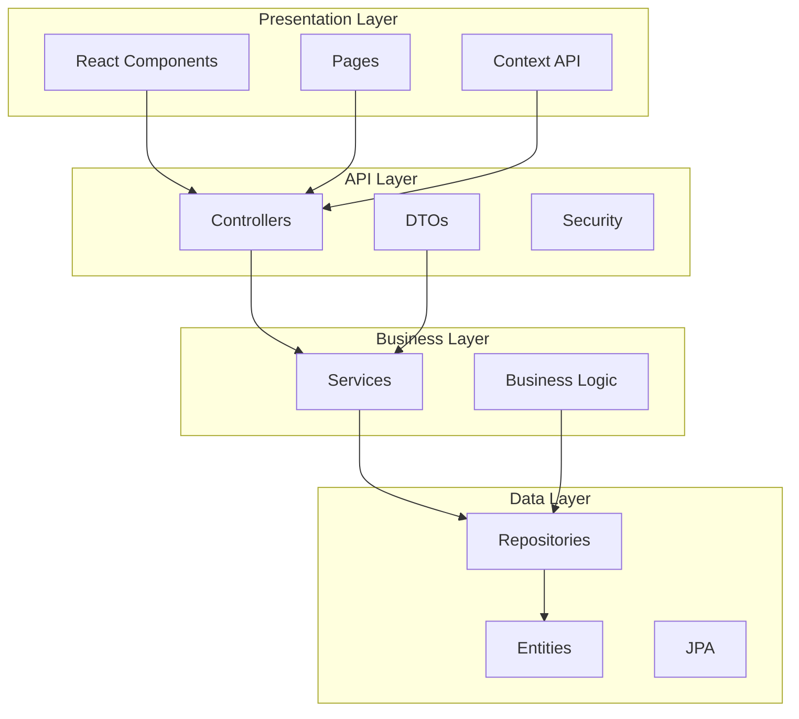
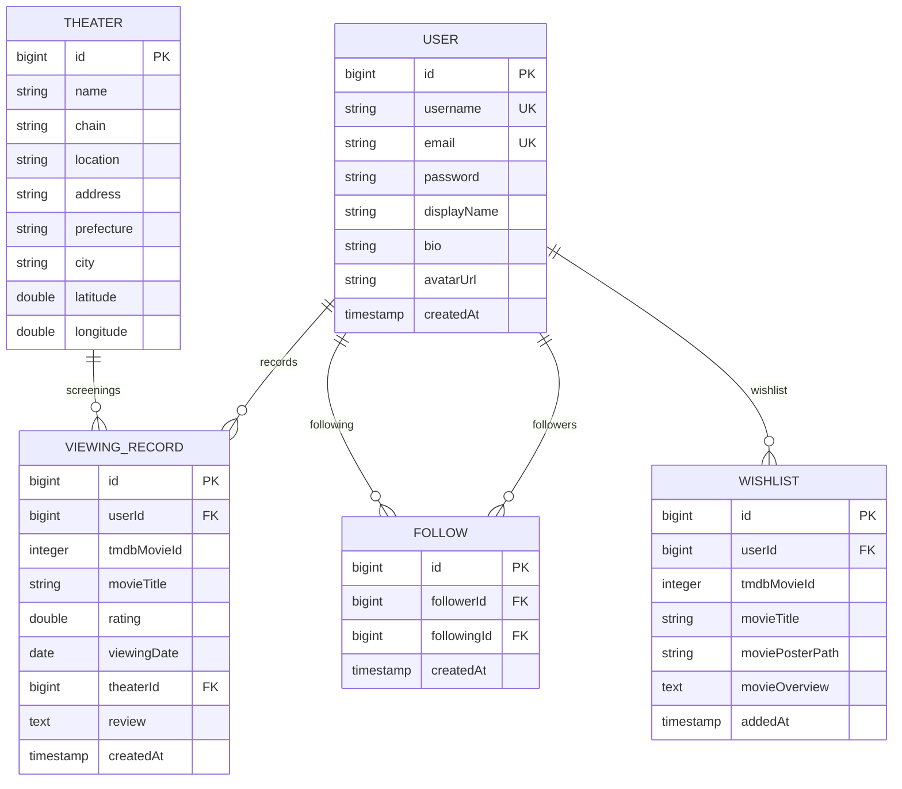

# システム概要設計書

## 1. システム概要

### 1.1 プロジェクト概要
**cineTrack** は映画鑑賞記録Webアプリケーションです。ユーザーが映画の鑑賞履歴を記録・管理し、他のユーザーとの交流を通じて映画体験を共有できるソーシャル機能を提供します。

### 1.2 システムの目的
- 個人の映画鑑賞履歴の体系的な記録・管理
- TMDb（The Movie Database）APIとの連携による豊富な映画情報の提供
- ユーザー間のフォロー機能による映画コミュニティの形成
- 鑑賞データの分析・可視化による映画嗜好の把握
- 劇場情報管理による鑑賞体験の記録

### 1.3 主要機能
- **認証機能**: JWT認証によるセキュアなユーザー管理
- **映画検索・閲覧**: TMDb API連携による映画情報取得
- **鑑賞記録管理**: 評価・鑑賞日・劇場情報の記録
- **ソーシャル機能**: ユーザーフォロー・アクティビティフィード
- **統計・分析**: 鑑賞データの可視化
- **ウィッシュリスト**: 観たい映画の管理
- **劇場検索**: 地域別劇場情報の検索

## 2. 技術スタック

### 2.1 フロントエンド
| 技術 | バージョン | 用途 |
|------|-----------|------|
| React | 19.1.0 | UIフレームワーク |
| Material-UI | 7.2.0 | UIコンポーネントライブラリ |
| React Router | 7.6.3 | SPA ルーティング |
| Axios | 1.10.0 | HTTP通信 |
| Recharts | 3.1.0 | 統計グラフ表示 |
| Jest + Testing Library | 16.3.0 | テスティング |

参照: `/frontend/package.json:8-19`

### 2.2 バックエンド
| 技術 | バージョン | 用途 |
|------|-----------|------|
| Java | 17 | プログラミング言語 |
| Spring Boot | 3.3.0 | アプリケーションフレームワーク |
| Spring Security | - | 認証・認可 |
| Spring Data JPA | - | データアクセス層 |
| JWT | 0.11.5 | トークン認証 |
| WebFlux | - | 非同期HTTP通信 |
| Maven | - | ビルドツール |

参照: `/backend/pom.xml:9-92`

### 2.3 データベース
| 技術 | 用途 |
|------|------|
| PostgreSQL 15 | 本番環境データベース |
| H2 Database | テスト環境データベース |

参照: `/docker-compose.yml:6`, `/backend/pom.xml:53`

### 2.4 インフラ・運用
| 技術 | 用途 |
|------|------|
| Docker | コンテナ化 |
| Docker Compose | マルチコンテナ管理 |
| JaCoCo | テストカバレッジ測定 |

## 3. アーキテクチャ概要

### 3.1 システム構成

```mermaid
graph TB
    subgraph "Frontend Layer"
        A[React SPA<br/>Port: 3000]
    end
    
    subgraph "Backend Layer"
        B[Spring Boot API<br/>Port: 8080]
    end
    
    subgraph "Data Layer"
        C[PostgreSQL<br/>Port: 5432]
    end
    
    subgraph "External Services"
        D[TMDb API<br/>movie database]
    end
    
    A --|"HTTP/HTTPS<br/>JWT Token"| B
    B --|"JDBC<br/>JPA/Hibernate"| C
    B --|"REST API<br/>WebFlux"| D
```

### 3.2 レイヤー構成



## 4. 主要エンティティ

### 4.1 エンティティ関係図



参照: `/backend/src/main/java/com/cinetrack/entity/`

### 4.2 主要エンティティ詳細

#### User エンティティ
- **ファイル**: `User.java:15-70`
- **特徴**: Spring Security UserDetails実装
- **認証**: BCryptパスワードハッシュ化
- **関係**: 鑑賞記録・フォロー・ウィッシュリストとの1対多関係

#### ViewingRecord エンティティ  
- **ファイル**: `ViewingRecord.java:11-60`
- **特徴**: 映画鑑賞の詳細記録
- **評価**: 0.5-5.0の範囲でバリデーション
- **関係**: ユーザー・劇場との多対1関係

## 5. API設計概要

### 5.1 エンドポイント分類

| カテゴリ | エンドポイント数 | 主要機能 |
|----------|----------------|----------|
| 認証 | 3 | login, register, me |
| 映画 | 5 | trending, popular, search, details |
| 鑑賞記録 | 8 | CRUD操作, 統計 |
| ソーシャル | 5 | フォロー, ユーザー検索 |
| ウィッシュリスト | 4 | 追加, 削除, 確認 |
| 劇場 | 3 | 検索, 一覧 |
| 統計 | 3 | 月別, ジャンル別統計 |

### 5.2 認証方式
- **方式**: JWT Bearer Token
- **実装**: Spring Security + JWT Filter
- **トークン有効期限**: 24時間（86400秒）

参照: `/backend/src/main/resources/application.yml:37-39`

## 6. セキュリティ設計

### 6.1 認証・認可
- **JWT認証**: ステートレス認証
- **パスワード**: BCrypt暗号化
- **CORS**: React開発サーバー許可設定
- **API保護**: 認証必須エンドポイントの明確化

### 6.2 設定ファイル
```yaml
# application.yml:47-48
cors:
  allowed-origins: ${CORS_ALLOWED_ORIGINS:http://localhost:3000}
```

## 7. 外部API連携

### 7.1 TMDb API
- **用途**: 映画情報取得
- **認証**: APIキー認証
- **設定**: `application.yml:42-44`
- **主要エンドポイント**: 
  - トレンド映画取得
  - 映画検索
  - 映画詳細情報

## 8. 開発・運用環境

### 8.1 開発環境
- **起動方法**: `./start-dev.sh` または `docker-compose up`
- **ポート構成**: 
  - Frontend: 3000
  - Backend: 8080  
  - Database: 5432

### 8.2 テスト環境
- **フロントエンド**: Jest + React Testing Library
- **バックエンド**: JUnit 5 + Mockito
- **カバレッジ**: 
  - Backend: 96%+ instructions, 92%+ branches
  - Frontend: 90%+ statements, 82%+ branches

### 8.3 環境変数
| 変数名 | 用途 | 必須 |
|--------|------|------|
| TMDB_API_KEY | TMDb API認証 | ✓ |
| JWT_SECRET | JWT署名鍵 | ✓ |
| SPRING_DATASOURCE_URL | DB接続URL | ✓ |
| CORS_ALLOWED_ORIGINS | CORS許可オリジン | - |

参照: `.env.example`

## 9. ディレクトリ構成

```
cineTrack/
├── backend/                    # Spring Boot アプリケーション
│   ├── src/main/java/com/cinetrack/
│   │   ├── controller/        # REST APIコントローラー (8個)
│   │   ├── service/          # ビジネスロジック (7個)
│   │   ├── entity/           # JPAエンティティ (5個)
│   │   ├── repository/       # データアクセス (5個)
│   │   ├── dto/              # データ転送オブジェクト (15個)
│   │   ├── security/         # JWT認証 (2個)
│   │   └── config/           # 設定クラス (2個)
│   └── src/test/             # テストスイート
├── frontend/                  # React アプリケーション
│   ├── src/
│   │   ├── components/       # 再利用コンポーネント
│   │   ├── pages/           # ページコンポーネント (14個)
│   │   ├── context/         # 認証コンテキスト
│   │   └── __mocks__/       # テストモック
├── docs/                     # 設計書
├── docker-compose.yml        # マルチコンテナ定義
├── setup.sh                 # 初回セットアップ
└── start-dev.sh             # 開発環境起動
```

## 10. 今後の拡張可能性

### 10.1 機能拡張
- レコメンデーション機能
- レビュー機能の強化
- 映画館予約連携
- モバイルアプリ対応

### 10.2 技術的拡張
- マイクロサービス化
- Redis キャッシュ導入
- Elasticsearch 全文検索
- AWS/GCP クラウド展開

---

**作成日**: 2025-07-23  
**対象バージョン**: cineTrack v1.0  
**更新履歴**: 初版作成