# システム構成図・アーキテクチャ設計書

## 1. システム構成概要

### 1.1 全体システム構成図

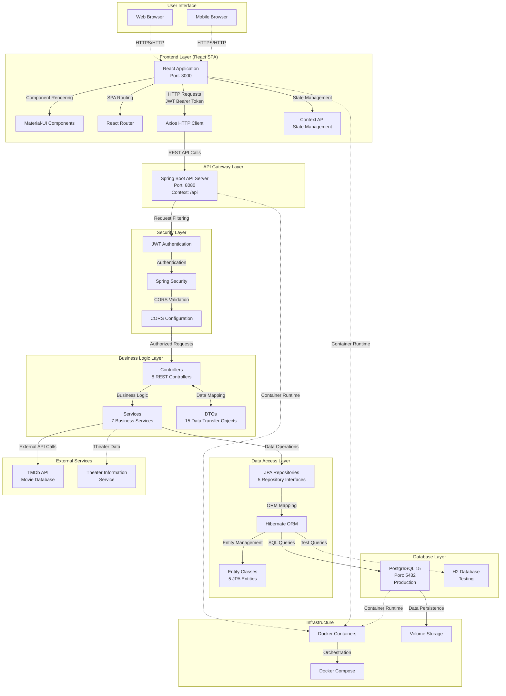

### 1.2 ネットワーク構成図

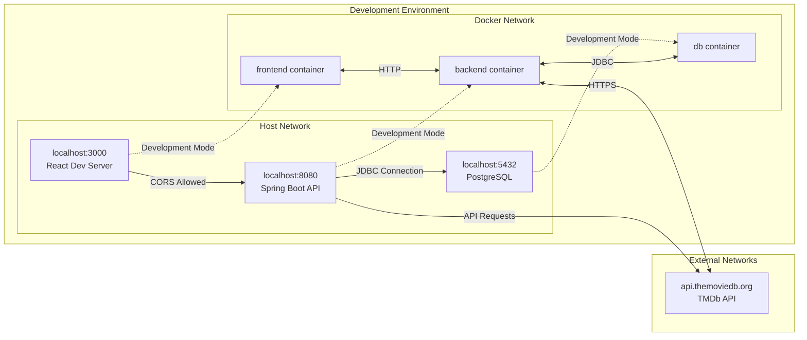

## 2. レイヤードアーキテクチャ

### 2.1 アプリケーション層構成

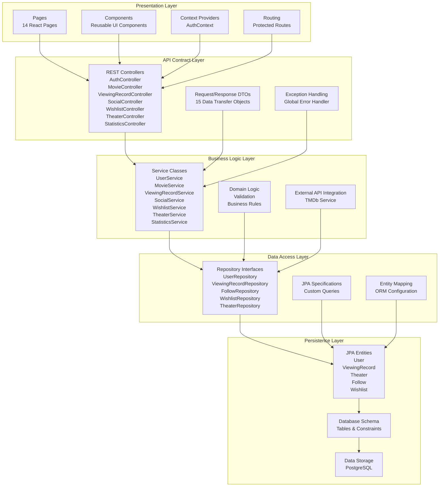

### 2.2 フロントエンド アーキテクチャ

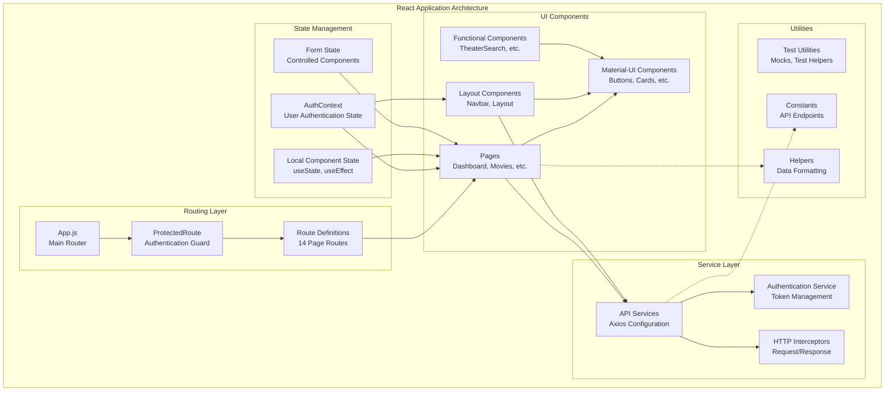

## 3. データフロー アーキテクチャ

### 3.1 認証データフロー

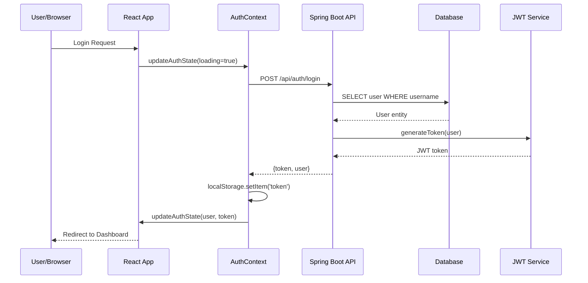

### 3.2 データ操作フロー

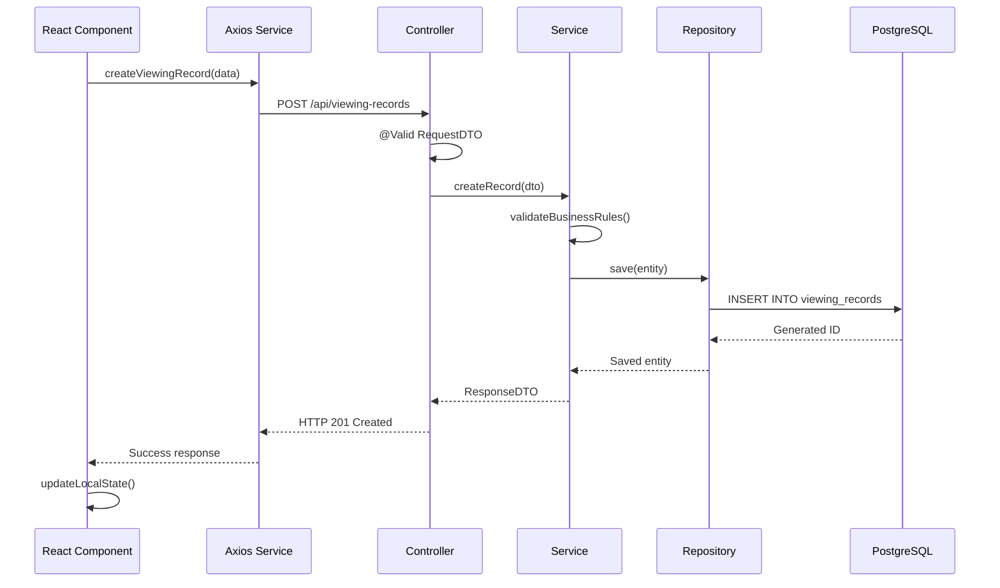

## 4. セキュリティアーキテクチャ

### 4.1 認証・認可フロー

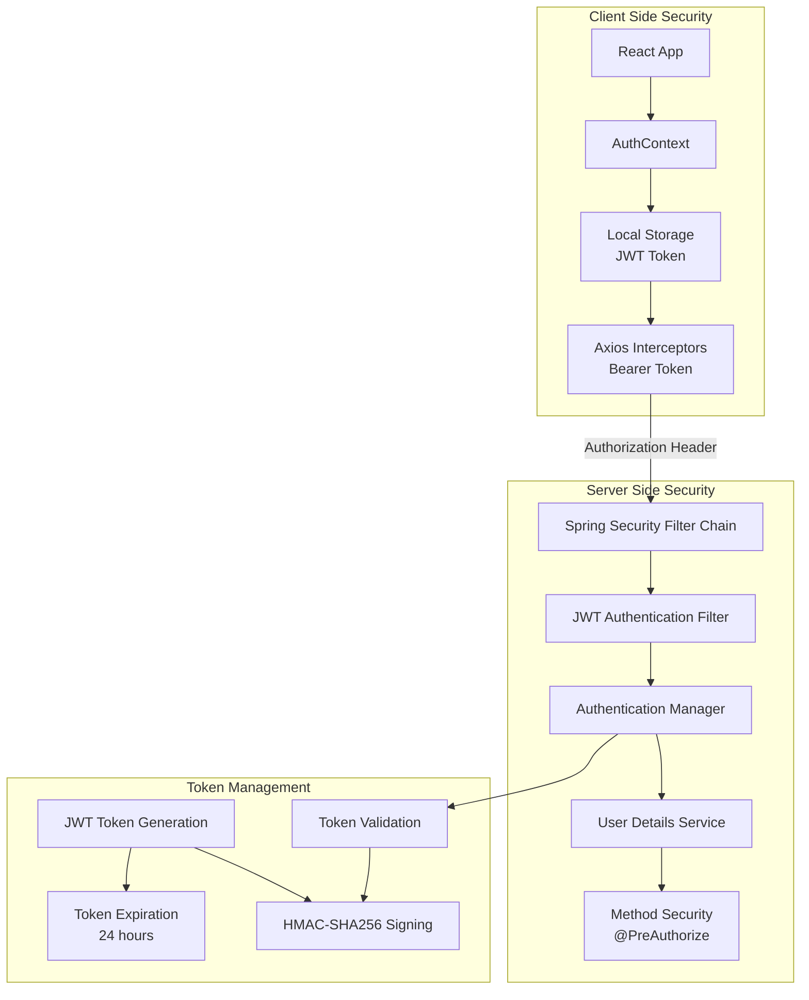

### 4.2 CORS設定とAPI保護

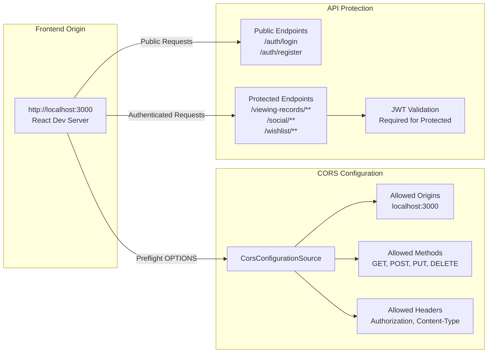

## 5. 外部連携アーキテクチャ

### 5.1 TMDb API連携

```mermaid
graph TB
    subgraph "cineTrack Backend"
        B1[MovieController]
        B2[MovieService]
        B3[TMDb API Client<br/>WebFlux]
        B4[Response Mapping<br/>TMDb DTO → Internal DTO]
    end
    
    subgraph "TMDb API"
        T1[https://api.themoviedb.org/3]
        T2[/trending/movie/day]
        T3[/search/movie]
        T4[/movie/{id}]
        T5[API Key Authentication]
    end
    
    subgraph "Data Flow"
        D1[Movie Search Request]
        D2[API Response Caching]
        D3[Error Handling<br/>Retry Logic]
    end
    
    B1 --> B2
    B2 --> B3
    B3 -->|HTTPS Requests| T1
    T1 --> T2
    T1 --> T3
    T1 --> T4
    T1 --> T5
    
    B3 --> B4
    B4 --> D2
    B3 --> D3
    
    D1 --> B1
```

### 5.2 データ同期・整合性

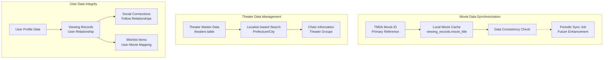

## 6. パフォーマンス・スケーラビリティ

### 6.1 データアクセス最適化

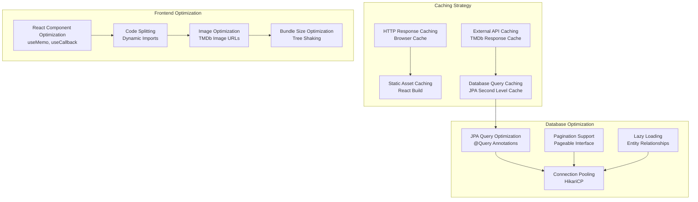

## 7. 拡張性・保守性

### 7.1 モジュール分離設計

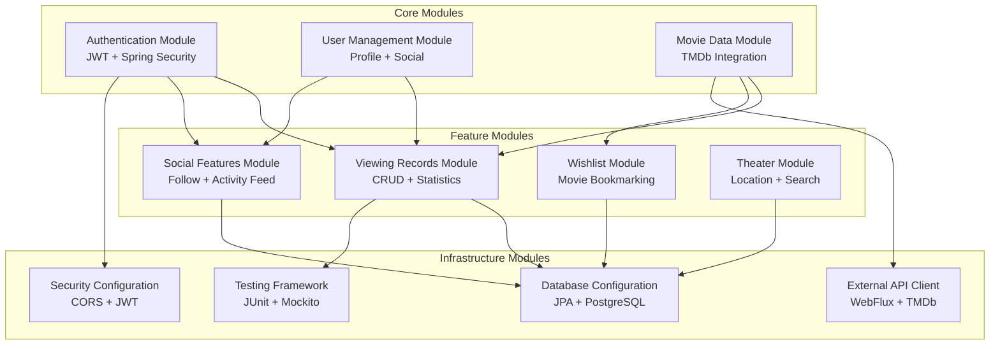

### 7.2 将来の拡張ポイント

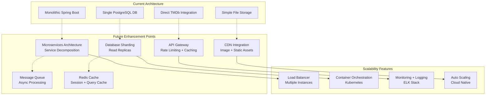

---

**作成日**: 2025-07-23  
**対象バージョン**: cineTrack v1.0  
**参照ファイル**: 
- `/backend/src/main/java/com/cinetrack/` - 全コントローラー・サービス・エンティティ
- `/frontend/src/` - React コンポーネント・ページ・コンテキスト
- `/docker-compose.yml` - インフラ構成
- `/backend/src/main/resources/application.yml` - 設定情報