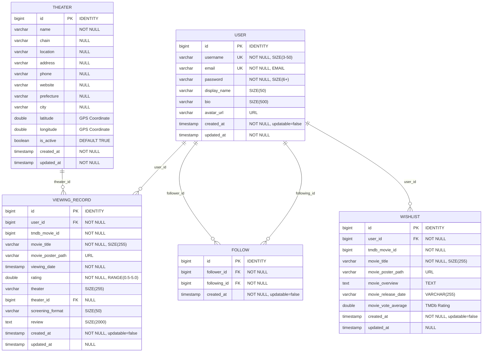
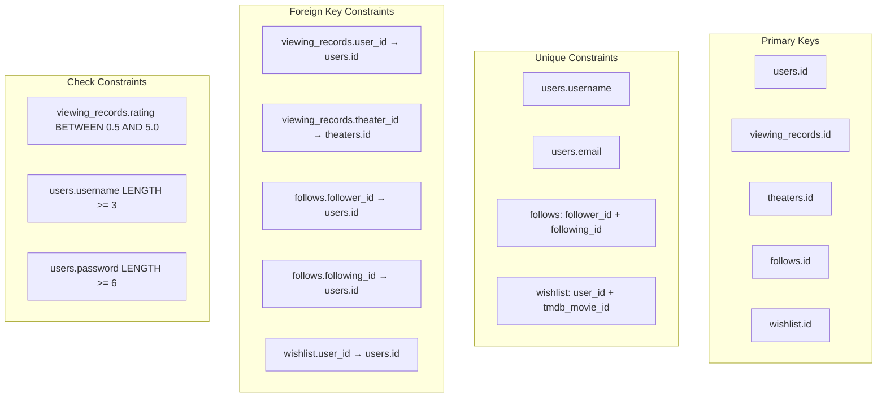
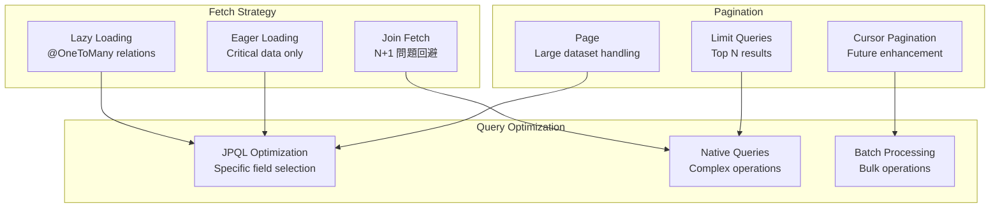

# データベース設計書

## 1. データベース概要

### 1.1 データベース環境構成

| 環境 | データベース | URL | 用途 |
|------|-------------|-----|------|
| 本番/開発 | PostgreSQL 15 | jdbc:postgresql://localhost:5432/cinetrack | メインデータストレージ |
| テスト | H2 Database | jdbc:h2:mem:testdb | 単体・統合テスト |

参照: `/backend/src/main/resources/application.yml`, `/backend/src/main/resources/application-test.yml`

### 1.2 データベース設定

```yaml
# 本番環境設定
spring:
  datasource:
    url: ${SPRING_DATASOURCE_URL:jdbc:postgresql://localhost:5432/cinetrack}
    username: ${SPRING_DATASOURCE_USERNAME:cinetrack_user}
    password: ${SPRING_DATASOURCE_PASSWORD:cinetrack123}
  jpa:
    hibernate:
      ddl-auto: update  # スキーマ自動更新
    database-platform: org.hibernate.dialect.PostgreSQLDialect
    show-sql: true     # SQL出力有効
```

参照: `/backend/src/main/resources/application.yml:5-14`

## 2. エンティティ関係図（ER図）

### 2.1 概要ER図



### 2.2 制約関係図



## 3. テーブル詳細設計

### 3.1 users テーブル

**エンティティファイル**: `User.java:14-173`

| カラム名 | データ型 | 制約 | デフォルト | 説明 |
|---------|---------|-----|-----------|------|
| id | BIGINT | PRIMARY KEY, IDENTITY | AUTO | ユーザーID |
| username | VARCHAR(50) | UNIQUE, NOT NULL | - | ユーザー名（3-50文字） |
| email | VARCHAR(255) | UNIQUE, NOT NULL | - | メールアドレス |
| password | VARCHAR(255) | NOT NULL | - | BCrypt暗号化パスワード（6文字以上） |
| display_name | VARCHAR(50) | NULL | - | 表示名 |
| bio | VARCHAR(500) | NULL | - | 自己紹介文 |
| avatar_url | VARCHAR(255) | NULL | - | アバター画像URL |
| created_at | TIMESTAMP | NOT NULL, 更新不可 | CURRENT_TIMESTAMP | 作成日時 |
| updated_at | TIMESTAMP | NOT NULL | CURRENT_TIMESTAMP | 更新日時 |

#### バリデーション詳細
- **username**: `@NotBlank @Size(min = 3, max = 50)` (User.java:22-24)
- **email**: `@NotBlank @Email` (User.java:27-29)
- **password**: `@NotBlank @Size(min = 6)` (User.java:32-34)
- **displayName**: `@Size(max = 50)` (User.java:36-37)
- **bio**: `@Size(max = 500)` (User.java:40-41)
- **Spring Security**: UserDetails実装 (User.java:16)

### 3.2 viewing_records テーブル

**エンティティファイル**: `ViewingRecord.java:10-193`

| カラム名 | データ型 | 制約 | デフォルト | 説明 |
|---------|---------|-----|-----------|------|
| id | BIGINT | PRIMARY KEY, IDENTITY | AUTO | 鑑賞記録ID |
| user_id | BIGINT | FOREIGN KEY, NOT NULL | - | ユーザーID |
| tmdb_movie_id | BIGINT | NOT NULL | - | TMDb映画ID |
| movie_title | VARCHAR(255) | NOT NULL | - | 映画タイトル |
| movie_poster_path | VARCHAR(255) | NULL | - | ポスター画像パス |
| viewing_date | TIMESTAMP | NOT NULL | - | 鑑賞日時 |
| rating | DOUBLE | NOT NULL, 0.5-5.0 | - | 評価（0.5刻み） |
| theater | VARCHAR(255) | NULL | - | 劇場名（テキスト） |
| theater_id | BIGINT | FOREIGN KEY, NULL | - | 劇場エンティティID |
| screening_format | VARCHAR(50) | NULL | - | 上映形式（IMAX等） |
| review | TEXT | NULL | - | レビュー（2000文字以内） |
| created_at | TIMESTAMP | NOT NULL, 更新不可 | CURRENT_TIMESTAMP | 作成日時 |
| updated_at | TIMESTAMP | NULL | - | 更新日時 |

#### バリデーション詳細
- **tmdbMovieId**: `@NotNull` (ViewingRecord.java:24-25)
- **movieTitle**: `@NotBlank @Size(max = 255)` (ViewingRecord.java:28-30)
- **viewingDate**: `@NotNull` (ViewingRecord.java:36)
- **rating**: `@NotNull @DecimalMin("0.5") @DecimalMax("5.0")` (ViewingRecord.java:40-43)
- **theater**: `@Size(max = 255)` (ViewingRecord.java:46)
- **screeningFormat**: `@Size(max = 50)` (ViewingRecord.java:55)
- **review**: `@Size(max = 2000)` (ViewingRecord.java:59)
- **JSON処理**: `@JsonBackReference` でUser関係の循環参照回避 (ViewingRecord.java:20)

### 3.3 theaters テーブル

**エンティティファイル**: `Theater.java:8-208`

| カラム名 | データ型 | 制約 | デフォルト | 説明 |
|---------|---------|-----|-----------|------|
| id | BIGINT | PRIMARY KEY, IDENTITY | AUTO | 劇場ID |
| name | VARCHAR(255) | NOT NULL | - | 劇場名 |
| chain | VARCHAR(255) | NULL | - | チェーン名（TOHOシネマズ等） |
| location | VARCHAR(255) | NULL | - | 場所詳細 |
| address | VARCHAR(255) | NULL | - | 住所 |
| phone | VARCHAR(255) | NULL | - | 電話番号 |
| website | VARCHAR(255) | NULL | - | ウェブサイトURL |
| prefecture | VARCHAR(255) | NULL | - | 都道府県 |
| city | VARCHAR(255) | NULL | - | 市区町村 |
| latitude | DOUBLE | NULL | - | 緯度（GPS座標） |
| longitude | DOUBLE | NULL | - | 経度（GPS座標） |
| is_active | BOOLEAN | NOT NULL | TRUE | アクティブフラグ |
| created_at | TIMESTAMP | NOT NULL | CURRENT_TIMESTAMP | 作成日時 |
| updated_at | TIMESTAMP | NOT NULL | CURRENT_TIMESTAMP | 更新日時 |

#### バリデーション詳細
- **name**: `@NotBlank` (Theater.java:17)
- **isActive**: デフォルト値 `true` (Theater.java:48)

#### 検索機能
- **地域検索**: prefecture, city による絞り込み
- **近隣検索**: latitude, longitude による範囲検索
- **テキスト検索**: name, chain, location での部分一致

### 3.4 follows テーブル

**エンティティファイル**: `Follow.java:8-95`

| カラム名 | データ型 | 制約 | デフォルト | 説明 |
|---------|---------|-----|-----------|------|
| id | BIGINT | PRIMARY KEY, IDENTITY | AUTO | フォローID |
| follower_id | BIGINT | FOREIGN KEY, NOT NULL | - | フォロワーのユーザーID |
| following_id | BIGINT | FOREIGN KEY, NOT NULL | - | フォロー対象のユーザーID |
| created_at | TIMESTAMP | NOT NULL, 更新不可 | CURRENT_TIMESTAMP | フォロー開始日時 |

#### 制約詳細
- **複合ユニーク制約**: `(follower_id, following_id)` - 重複フォロー防止 (Follow.java:9-10)
- **JSON処理**: `@JsonBackReference` で循環参照回避 (Follow.java:19, 24)
- **自己参照防止**: アプリケーションレベルで制御
- **相互フォロー**: 別レコードで管理

### 3.5 wishlist テーブル

**エンティティファイル**: `Wishlist.java:9-155`

| カラム名 | データ型 | 制約 | デフォルト | 説明 |
|---------|---------|-----|-----------|------|
| id | BIGINT | PRIMARY KEY, IDENTITY | AUTO | ウィッシュリストID |
| user_id | BIGINT | FOREIGN KEY, NOT NULL | - | ユーザーID |
| tmdb_movie_id | BIGINT | NOT NULL | - | TMDb映画ID |
| movie_title | VARCHAR(255) | NOT NULL | - | 映画タイトル |
| movie_poster_path | VARCHAR(255) | NULL | - | ポスター画像パス |
| movie_overview | TEXT | NULL | - | 映画概要 |
| movie_release_date | VARCHAR(255) | NULL | - | 公開日 |
| movie_vote_average | DOUBLE | NULL | - | TMDb平均評価 |
| created_at | TIMESTAMP | NOT NULL, 更新不可 | CURRENT_TIMESTAMP | 追加日時 |
| updated_at | TIMESTAMP | NULL | - | 更新日時 |

#### バリデーション詳細
- **tmdbMovieId**: `@NotNull` (Wishlist.java:25)
- **movieTitle**: `@NotBlank @Size(max = 255)` (Wishlist.java:29-30)
- **JSON処理**: `@JsonBackReference` でUser関係の循環参照回避 (Wishlist.java:21)

#### 制約詳細
- **複合ユニーク制約**: `(user_id, tmdb_movie_id)` - 重複登録防止 (Wishlist.java:10-12)

## 4. データアクセス層設計

### 4.1 リポジトリパターン実装

```mermaid
graph TB
    subgraph "Repository Layer"
        R1[UserRepository]
        R2[ViewingRecordRepository]
        R3[TheaterRepository]
        R4[FollowRepository]
        R5[WishlistRepository]
    end
    
    subgraph "JPA Infrastructure"
        JPA1[JpaRepository<Entity, Long>]
        JPA2[CrudRepository<Entity, Long>]
        JPA3[PagingAndSortingRepository]
    end
    
    subgraph "Custom Query Methods"
        CQ1[Derived Queries]
        CQ2[@Query Annotations]
        CQ3[Native Queries]
        CQ4[Specifications]
    end
    
    R1 --> JPA1
    R2 --> JPA1
    R3 --> JPA1
    R4 --> JPA1
    R5 --> JPA1
    
    R1 --> CQ1
    R2 --> CQ2
    R3 --> CQ2
    R4 --> CQ2
    R5 --> CQ1
```

### 4.2 主要カスタムクエリ

#### ViewingRecordRepository の複雑クエリ

```java
// 評価条件付き検索 (ViewingRecordRepository.java:23-24)
@Query("SELECT vr FROM ViewingRecord vr WHERE vr.user.id = :userId AND vr.rating >= :minRating ORDER BY vr.viewingDate DESC")
Page<ViewingRecord> findByUserIdAndRatingGreaterThanEqual(@Param("userId") Long userId, @Param("minRating") Double minRating, Pageable pageable);

// 期間指定検索 (ViewingRecordRepository.java:26-27)
@Query("SELECT vr FROM ViewingRecord vr WHERE vr.user.id = :userId AND vr.viewingDate BETWEEN :startDate AND :endDate ORDER BY vr.viewingDate DESC")
List<ViewingRecord> findByUserIdAndViewingDateBetween(@Param("userId") Long userId, @Param("startDate") LocalDateTime startDate, @Param("endDate") LocalDateTime endDate);

// 統計情報取得 (ViewingRecordRepository.java:35-36)
@Query("SELECT AVG(vr.rating) FROM ViewingRecord vr WHERE vr.user.id = :userId")
Double findAverageRatingByUserId(@Param("userId") Long userId);
```

#### TheaterRepository の地理検索

```java
// 近隣劇場検索 (TheaterRepository.java:37-44)
@Query("SELECT t FROM Theater t WHERE t.isActive = true AND " +
       "t.latitude BETWEEN :minLat AND :maxLat AND " +
       "t.longitude BETWEEN :minLng AND :maxLng " +
       "ORDER BY t.name")
List<Theater> findNearbyTheaters(@Param("minLat") Double minLat, @Param("maxLat") Double maxLat, 
                                @Param("minLng") Double minLng, @Param("maxLng") Double maxLng);

// 複合条件検索 (TheaterRepository.java:59-71)
@Query("SELECT t FROM Theater t WHERE t.isActive = true " +
       "AND (:query IS NULL OR :query = '' OR " +
       "LOWER(t.name) LIKE LOWER(CONCAT('%', :query, '%')) OR " +
       "LOWER(t.chain) LIKE LOWER(CONCAT('%', :query, '%')) OR " +
       "LOWER(t.location) LIKE LOWER(CONCAT('%', :query, '%'))) " +
       "AND (:prefecture IS NULL OR :prefecture = '' OR t.prefecture = :prefecture) " +
       "AND (:city IS NULL OR :city = '' OR t.city = :city) " +
       "AND (:chain IS NULL OR :chain = '' OR t.chain = :chain) " +
       "ORDER BY t.name")
Page<Theater> findWithFilters(@Param("query") String query, @Param("prefecture") String prefecture, 
                             @Param("city") String city, @Param("chain") String chain, Pageable pageable);
```

#### FollowRepository のソーシャル機能

```java
// 相互フォロー確認 (FollowRepository.java:42-45)
@Query("SELECT CASE WHEN COUNT(f1) > 0 AND COUNT(f2) > 0 THEN true ELSE false END " +
       "FROM Follow f1 LEFT JOIN Follow f2 ON f1.follower.id = f2.following.id AND f1.following.id = f2.follower.id " +
       "WHERE f1.follower.id = :userId1 AND f1.following.id = :userId2")
Boolean areMutuallyFollowing(@Param("userId1") Long userId1, @Param("userId2") Long userId2);
```

## 5. インデックス設計

### 5.1 自動作成インデックス

| テーブル | インデックス | タイプ | 説明 |
|---------|-------------|-------|------|
| users | users_pkey | PRIMARY KEY | id列 |
| users | uk_username | UNIQUE | username列 |
| users | uk_email | UNIQUE | email列 |
| viewing_records | viewing_records_pkey | PRIMARY KEY | id列 |
| theaters | theaters_pkey | PRIMARY KEY | id列 |
| follows | follows_pkey | PRIMARY KEY | id列 |
| follows | uk_follow_relation | UNIQUE | follower_id, following_id |
| wishlist | wishlist_pkey | PRIMARY KEY | id列 |
| wishlist | uk_user_movie | UNIQUE | user_id, tmdb_movie_id |

### 5.2 推奨追加インデックス

```sql
-- 頻繁な検索条件用インデックス
CREATE INDEX idx_viewing_records_user_id ON viewing_records(user_id);
CREATE INDEX idx_viewing_records_viewing_date ON viewing_records(viewing_date);
CREATE INDEX idx_viewing_records_tmdb_movie_id ON viewing_records(tmdb_movie_id);
CREATE INDEX idx_viewing_records_rating ON viewing_records(rating);

-- 劇場検索用インデックス
CREATE INDEX idx_theaters_active ON theaters(is_active);
CREATE INDEX idx_theaters_prefecture ON theaters(prefecture);
CREATE INDEX idx_theaters_city ON theaters(city);
CREATE INDEX idx_theaters_chain ON theaters(chain);
CREATE INDEX idx_theaters_location ON theaters(latitude, longitude);

-- ソーシャル機能用インデックス
CREATE INDEX idx_follows_follower ON follows(follower_id);
CREATE INDEX idx_follows_following ON follows(following_id);
CREATE INDEX idx_follows_created ON follows(created_at);

-- ウィッシュリスト用インデックス
CREATE INDEX idx_wishlist_user_id ON wishlist(user_id);
CREATE INDEX idx_wishlist_created ON wishlist(created_at);
```

## 6. データ整合性・制約

### 6.1 参照整合性制約

```mermaid
graph TB
    subgraph "Cascade Operations"
        C1[User削除 → ViewingRecord削除]
        C2[User削除 → Follow削除]
        C3[User削除 → Wishlist削除]
        C4[Theater削除 → ViewingRecord.theater_id = NULL]
    end
    
    subgraph "Business Constraints"
        B1[Follow: follower ≠ following]
        B2[Rating: 0.5 ≤ rating ≤ 5.0]
        B3[Unique: user + movie per wishlist]
        B4[Unique: follower + following per follow]
    end
    
    subgraph "Data Validation"
        V1[@NotNull @NotBlank]
        V2[@Email validation]
        V3[@Size constraints]
        V4[@DecimalMin @DecimalMax]
    end
```

### 6.2 ビジネスルール制約

#### エンティティレベル制約
- **User**: ユーザー名・メール重複不可
- **ViewingRecord**: 評価は0.5-5.0の範囲、0.5刻み
- **Follow**: 自己フォロー不可、重複フォロー不可
- **Wishlist**: ユーザー毎に同一映画の重複登録不可

#### アプリケーションレベル制約
- **パスワード**: BCrypt暗号化必須
- **JWT**: 24時間有効期限
- **TMDb ID**: 外部API連携整合性
- **劇場情報**: isActive=true のみ検索対象

## 7. パフォーマンス最適化

### 7.1 クエリ最適化戦略



### 7.2 キャッシュ戦略

| レイヤー | キャッシュ対象 | 実装方式 | TTL |
|---------|--------------|----------|-----|
| JPA | Entity Cache | Hibernate 2nd Level | 1時間 |
| Application | TMDb API Response | In-Memory Map | 30分 |
| Database | Query Result Cache | PostgreSQL | 15分 |
| Browser | Static Assets | HTTP Cache | 24時間 |

## 8. セキュリティ考慮事項

### 8.1 データ保護

- **パスワード**: BCrypt暗号化（Strength: 12）
- **個人情報**: メール、プロフィール情報の保護
- **アクセス制御**: ユーザー毎のデータ分離
- **監査ログ**: created_at, updated_at による変更履歴

### 8.2 SQL インジェクション対策

- **パラメータ化クエリ**: @Query + @Param 使用
- **型安全性**: エンティティベースクエリ
- **入力検証**: Bean Validation アノテーション
- **エスケープ処理**: JPA自動処理

## 9. 運用・保守

### 9.1 データベースマイグレーション

```yaml
# Hibernate DDL設定
hibernate:
  ddl-auto: update  # 本番: validate 推奨
  
# マイグレーション戦略
- 開発: update（自動スキーマ更新）
- 本番: validate（スキーマ検証のみ）
- リリース: Flyway/Liquibase 導入検討
```

### 9.2 バックアップ・リカバリ

```bash
# PostgreSQL バックアップ
pg_dump -h localhost -U cinetrack_user -d cinetrack > backup.sql

# データ投入
psql -h localhost -U cinetrack_user -d cinetrack < backup.sql

# Docker Volume バックアップ
docker run --rm -v cinetrack_postgres_data:/data -v $(pwd):/backup alpine tar czf /backup/backup.tar.gz /data
```

### 9.3 監視・メンテナンス

- **接続プール**: HikariCP メトリクス監視
- **スロークエリ**: PostgreSQL log_min_duration_statement
- **テーブルサイズ**: 定期的なディスク使用量確認
- **インデックス**: 使用状況とパフォーマンス監視

---

**作成日**: 2025-07-23  
**対象バージョン**: cineTrack v1.0  
**参照エンティティ**: 
- `User.java` - ユーザー管理
- `ViewingRecord.java` - 鑑賞記録
- `Theater.java` - 劇場情報
- `Follow.java` - フォロー関係
- `Wishlist.java` - ウィッシュリスト
**参照リポジトリ**: 各エンティティ対応Repository（5クラス）