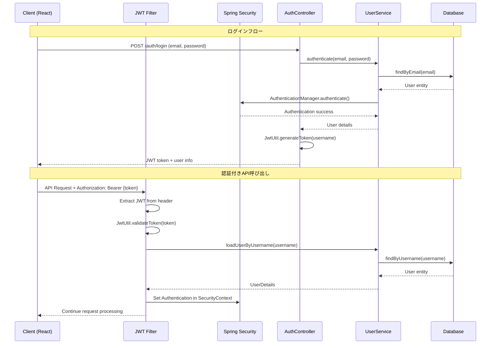
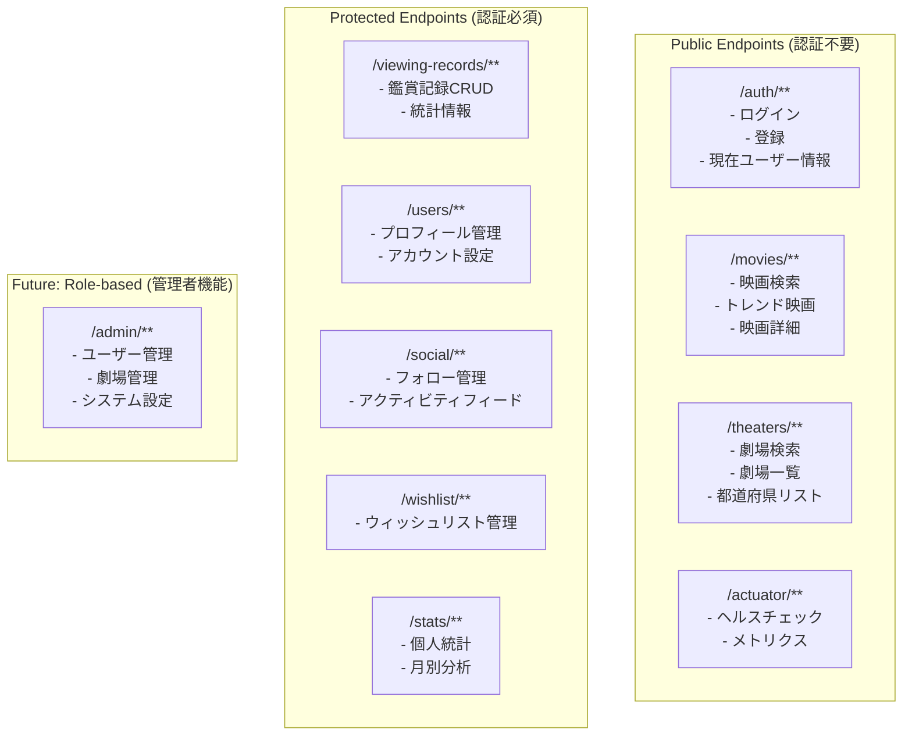
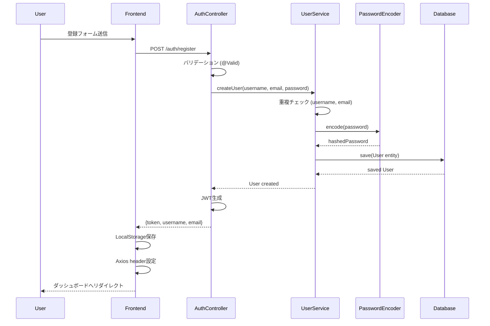
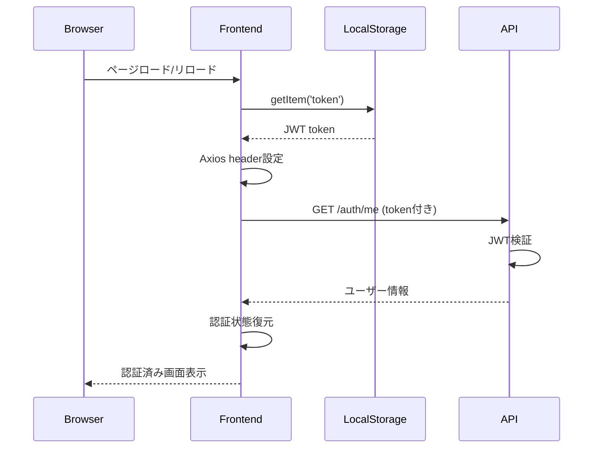

# 認証・認可設計書

## 1. 認証アーキテクチャ概要

### 1.1 認証方式

| 項目 | 実装方式 | 説明 |
|------|---------|------|
| 認証方式 | JWT (JSON Web Token) | ステートレス認証 |
| 署名アルゴリズム | HMAC-SHA256 (HS256) | 対称暗号化 |
| トークン有効期限 | 24時間 (86400秒) | 設定可能 |
| セッション管理 | ステートレス | HTTPセッション無効 |
| パスワード暗号化 | BCrypt (強度10) | ハッシュ化 |

### 1.2 認証アーキテクチャ図



## 2. Spring Security設定

### 2.1 SecurityConfig クラス

**ファイル**: `SecurityConfig.java` (行28-92)

```java
@Configuration
@EnableWebSecurity
@EnableMethodSecurity(prePostEnabled = true)
public class SecurityConfig {
    
    // 主要設定
    @Bean
    public PasswordEncoder passwordEncoder() {
        return new BCryptPasswordEncoder(); // 強度10 (デフォルト)
    }
    
    @Bean
    public SecurityFilterChain filterChain(HttpSecurity http) throws Exception {
        return http
            .cors(cors -> cors.configurationSource(corsConfigurationSource()))
            .csrf(csrf -> csrf.disable()) // REST API用
            .sessionManagement(session -> 
                session.sessionCreationPolicy(SessionCreationPolicy.STATELESS))
            .authorizeHttpRequests(auth -> auth
                .requestMatchers("/auth/**").permitAll()     // 認証不要
                .requestMatchers("/movies/**").permitAll()   // 映画情報
                .requestMatchers("/theaters/**").permitAll() // 劇場情報
                .requestMatchers("/actuator/**").permitAll() // 監視
                .anyRequest().authenticated()                // その他は認証必須
            )
            .addFilterBefore(jwtAuthenticationFilter(), 
                UsernamePasswordAuthenticationFilter.class)
            .build();
    }
}
```

参照: `/backend/src/main/java/com/cinetrack/config/SecurityConfig.java:62-77`

### 2.2 認証・認可レベル



## 3. JWT認証実装

### 3.1 JWT構成

```mermaid
graph LR
    subgraph "JWT Token Structure"
        H[Header<br/>{"alg": "HS256",<br/>"typ": "JWT"}]
        P[Payload<br/>{"sub": "username",<br/>"iat": timestamp,<br/>"exp": timestamp}]
        S[Signature<br/>HMACSHA256<br/>(base64(header) + "." +<br/>base64(payload), secret)]
    end
    
    H --> DOT1[.]
    DOT1 --> P
    P --> DOT2[.]
    DOT2 --> S
```

### 3.2 JwtUtil クラス実装

**ファイル**: `JwtUtil.java` (行21-85)

```java
@Component
public class JwtUtil {
    
    @Value("${jwt.secret}")
    private String secret;
    
    @Value("${jwt.expiration}")
    private Long expiration;
    
    private Key getSigningKey() {
        byte[] keyBytes = secret.getBytes(StandardCharsets.UTF_8);
        return Keys.hmacShaKeyFor(keyBytes);
    }
    
    // トークン生成
    public String generateToken(String username) {
        return Jwts.builder()
            .setSubject(username)
            .setIssuedAt(new Date(System.currentTimeMillis()))
            .setExpiration(new Date(System.currentTimeMillis() + expiration * 1000))
            .signWith(getSigningKey(), SignatureAlgorithm.HS256)
            .compact();
    }
    
    // トークン検証
    public Boolean validateToken(String token, UserDetails userDetails) {
        final String username = extractUsername(token);
        return (username.equals(userDetails.getUsername()) && !isTokenExpired(token));
    }
}
```

### 3.3 JWTフィルター実装

**ファイル**: `JwtAuthenticationFilter.java` (行29-75)

```java
@Component
public class JwtAuthenticationFilter extends OncePerRequestFilter {
    
    @Override
    protected void doFilterInternal(HttpServletRequest request, 
                                  HttpServletResponse response, 
                                  FilterChain filterChain) throws ServletException, IOException {
        
        String authHeader = request.getHeader("Authorization");
        String token = null;
        String username = null;
        
        // Bearer トークンの抽出
        if (authHeader != null && authHeader.startsWith("Bearer ")) {
            token = authHeader.substring(7);
            try {
                username = jwtUtil.extractUsername(token);
            } catch (Exception e) {
                logger.error("JWT token extraction error: {}", e.getMessage());
            }
        }
        
        // 認証処理
        if (username != null && SecurityContextHolder.getContext().getAuthentication() == null) {
            UserDetails userDetails = userDetailsService.loadUserByUsername(username);
            
            if (jwtUtil.validateToken(token, userDetails)) {
                UsernamePasswordAuthenticationToken authToken = 
                    new UsernamePasswordAuthenticationToken(userDetails, null, userDetails.getAuthorities());
                authToken.setDetails(new WebAuthenticationDetailsSource().buildDetails(request));
                SecurityContextHolder.getContext().setAuthentication(authToken);
            }
        }
        
        filterChain.doFilter(request, response);
    }
}
```

参照: `/backend/src/main/java/com/cinetrack/security/JwtAuthenticationFilter.java:48-68`

## 4. パスワードセキュリティ

### 4.1 BCrypt暗号化設定

**実装**: `UserService.java`

```java
@Service
public class UserService {
    
    @Autowired
    private PasswordEncoder passwordEncoder;
    
    // ユーザー作成時
    public User createUser(String username, String email, String rawPassword) {
        User user = new User();
        user.setUsername(username);
        user.setEmail(email);
        user.setPassword(passwordEncoder.encode(rawPassword)); // BCrypt暗号化
        return userRepository.save(user);
    }
    
    // パスワード変更時の検証
    public boolean updatePassword(User user, String currentPassword, String newPassword) {
        if (!passwordEncoder.matches(currentPassword, user.getPassword())) {
            return false; // 現在のパスワードが一致しない
        }
        user.setPassword(passwordEncoder.encode(newPassword));
        userRepository.save(user);
        return true;
    }
}
```

参照: `UserService.java:43`, `UserService.java:103-107`

### 4.2 パスワード強度ポリシー

| 項目 | 制約 | 実装場所 |
|------|------|----------|
| 最小長 | 6文字以上 | `@Size(min = 6)` |
| 必須入力 | 必須 | `@NotBlank` |
| 暗号化強度 | BCrypt (コスト10) | `BCryptPasswordEncoder()` |
| 保存形式 | ハッシュ値のみ | データベース |

参照: `RegisterRequest.java:17-18`, `User.java:32-34`

## 5. CORS設定

### 5.1 CORS設定詳細

**ファイル**: `SecurityConfig.java` (行79-90)

```java
@Bean
public CorsConfigurationSource corsConfigurationSource() {
    CorsConfiguration configuration = new CorsConfiguration();
    
    // 許可オリジンの設定
    String[] allowedOrigins = corsAllowedOrigins.split(",");
    configuration.setAllowedOrigins(Arrays.asList(allowedOrigins));
    
    // 許可メソッドの設定
    configuration.setAllowedMethods(Arrays.asList("GET", "POST", "PUT", "DELETE", "OPTIONS"));
    
    // 許可ヘッダーの設定
    configuration.setAllowedHeaders(Arrays.asList("*"));
    
    // 資格情報許可
    configuration.setAllowCredentials(true);
    
    UrlBasedCorsConfigurationSource source = new UrlBasedCorsConfigurationSource();
    source.registerCorsConfiguration("/**", configuration);
    return source;
}
```

### 5.2 環境変数による設定

**ファイル**: `application.yml` (行47-48)

```yaml
cors:
  allowed-origins: ${CORS_ALLOWED_ORIGINS:http://localhost:3000}
```

**本番環境での設定例**:
```bash
CORS_ALLOWED_ORIGINS=https://cinetrack.example.com,https://www.cinetrack.example.com
```

## 6. フロントエンド認証実装

### 6.1 AuthContext実装

**ファイル**: `AuthContext.js` (行15-92)

```javascript
export const AuthProvider = ({ children }) => {
    const [user, setUser] = useState(null);
    const [token, setToken] = useState(localStorage.getItem('token'));
    const [loading, setLoading] = useState(true);
    
    // APIクライアント設定
    useEffect(() => {
        if (token) {
            axios.defaults.headers.common['Authorization'] = `Bearer ${token}`;
            // LocalStorageからユーザー情報復元
            const savedUser = localStorage.getItem('user');
            if (savedUser) {
                setUser(JSON.parse(savedUser));
            }
        }
    }, [token]);
    
    // ログイン処理
    const login = async (email, password) => {
        try {
            const response = await axios.post(`${API_BASE_URL}/auth/login`, {
                email,
                password
            });
            
            const { token: newToken, username, email: userEmail } = response.data.data;
            const userData = { username, email: userEmail };
            
            // 状態とストレージに保存
            setToken(newToken);
            setUser(userData);
            localStorage.setItem('token', newToken);
            localStorage.setItem('user', JSON.stringify(userData));
            
            // Axiosデフォルトヘッダー設定
            axios.defaults.headers.common['Authorization'] = `Bearer ${newToken}`;
            
            return { success: true };
        } catch (error) {
            return { success: false, message: error.response?.data?.message || 'ログインに失敗しました' };
        }
    };
    
    // ログアウト処理
    const logout = () => {
        setUser(null);
        setToken(null);
        localStorage.removeItem('token');
        localStorage.removeItem('user');
        delete axios.defaults.headers.common['Authorization'];
    };
}
```

### 6.2 保護ルート実装

**ファイル**: `ProtectedRoute.js` (行6-26)

```javascript
const ProtectedRoute = ({ children }) => {
    const { user, loading } = useAuth();
    
    // ローディング状態の処理
    if (loading) {
        return (
            <Box display="flex" justifyContent="center" alignItems="center" minHeight="200px">
                <CircularProgress />
                <Typography variant="h6" sx={{ ml: 2 }}>
                    読み込み中...
                </Typography>
            </Box>
        );
    }
    
    // 認証チェック
    if (!user) {
        return <Navigate to="/login" />;
    }
    
    return children;
};
```

### 6.3 HTTPインターセプター

```javascript
// レスポンスインターセプターでエラーハンドリング
axios.interceptors.response.use(
    (response) => response,
    (error) => {
        if (error.response?.status === 401) {
            // 認証エラー時の自動ログアウト
            logout();
            window.location.href = '/login';
        }
        return Promise.reject(error);
    }
);
```

## 7. 認証フロー詳細

### 7.1 ユーザー登録フロー



### 7.2 認証状態復元フロー



## 8. バリデーション・入力検証

### 8.1 サーバーサイドバリデーション

**LoginRequest**: `LoginRequest.java` (行8-17)
```java
public class LoginRequest {
    @NotBlank(message = "Email is required")
    @Email(message = "Invalid email format")
    private String email;
    
    @NotBlank(message = "Password is required")
    private String password;
}
```

**RegisterRequest**: `RegisterRequest.java` (行9-22)
```java
public class RegisterRequest {
    @NotBlank(message = "Username is required")
    @Size(min = 3, max = 50, message = "Username must be between 3 and 50 characters")
    private String username;
    
    @NotBlank(message = "Email is required")
    @Email(message = "Invalid email format")
    private String email;
    
    @NotBlank(message = "Password is required")
    @Size(min = 6, message = "Password must be at least 6 characters")
    private String password;
}
```

### 8.2 エンティティレベル制約

**User Entity**: `User.java` (行22-34)
```java
@Entity
@Table(name = "users")
public class User implements UserDetails {
    
    @NotBlank
    @Size(min = 3, max = 50)
    @Column(unique = true)
    private String username;
    
    @NotBlank
    @Email
    @Column(unique = true)
    private String email;
    
    @NotBlank
    @Size(min = 6)
    private String password;
}
```

## 9. セキュリティ設定詳細

### 9.1 JWT設定

**ファイル**: `application.yml` (行37-39)

```yaml
jwt:
  secret: ${JWT_SECRET:mySecretKeyForCineTrackApplicationMustBe256BitsLongForSecurity}
  expiration: ${JWT_EXPIRATION:86400}  # 24時間 (秒)
```

**本番環境での推奨設定**:
```bash
# 強力なシークレットキー (256ビット以上)
JWT_SECRET=your-super-secure-256-bit-secret-key-here

# 短い有効期限 (1時間)
JWT_EXPIRATION=3600
```

### 9.2 ログ設定

**デバッグログ**: `application.yml` (行50-53)
```yaml
logging:
  level:
    com.cinetrack: DEBUG
    org.springframework.security: DEBUG  # 本番では INFO レベル推奨
```

## 10. セキュリティ脆弱性対策

### 10.1 実装済み対策

| 脆弱性 | 対策 | 実装箇所 |
|--------|------|----------|
| パスワード漏洩 | BCrypt暗号化 | `UserService.java:43` |
| セッション固定攻撃 | ステートレス認証 | `SecurityConfig.java:65` |
| CSRF攻撃 | JWT認証 | `SecurityConfig.java:64` |
| XSS攻撃 | 入力検証 | `@Valid`, Bean Validation |
| SQLインジェクション | JPA/Hibernate | Repository層 |
| JWT改ざん | HMAC-SHA256署名 | `JwtUtil.java` |

### 10.2 推奨追加対策

#### Rate Limiting (レート制限)
```java
// 将来実装予定
@RestController
public class AuthController {
    
    @RateLimited(maxRequests = 5, timeWindow = "1m")
    @PostMapping("/login")
    public ResponseEntity<?> login(@RequestBody LoginRequest request) {
        // ログイン処理
    }
}
```

#### セキュリティヘッダー
```java
// SecurityConfig.java への追加推奨
@Bean
public SecurityFilterChain filterChain(HttpSecurity http) throws Exception {
    return http
        .headers(headers -> headers
            .contentTypeOptions(ContentTypeOptionsConfig::disable)
            .frameOptions(FrameOptionsConfig::deny)
            .httpStrictTransportSecurity(hstsConfig -> hstsConfig
                .maxAgeInSeconds(31536000)
                .includeSubdomains(true))
        )
        // 既存設定
        .build();
}
```

#### Token Blacklist (トークンブラックリスト)
```java
// 将来実装予定
@Service
public class TokenBlacklistService {
    
    private final RedisTemplate<String, String> redisTemplate;
    
    public void blacklistToken(String token) {
        String jti = extractJti(token);
        long expiration = extractExpiration(token);
        redisTemplate.opsForValue().set(
            "blacklist:" + jti, 
            "true", 
            Duration.ofSeconds(expiration)
        );
    }
    
    public boolean isBlacklisted(String token) {
        String jti = extractJti(token);
        return redisTemplate.hasKey("blacklist:" + jti);
    }
}
```

## 11. 監査・ログ

### 11.1 セキュリティイベントログ

```java
// 将来実装予定
@Component
public class SecurityEventLogger {
    
    private static final Logger securityLogger = LoggerFactory.getLogger("SECURITY");
    
    public void logSuccessfulLogin(String username, String ip) {
        securityLogger.info("SUCCESSFUL_LOGIN: user={}, ip={}", username, ip);
    }
    
    public void logFailedLogin(String email, String ip) {
        securityLogger.warn("FAILED_LOGIN: email={}, ip={}", email, ip);
    }
    
    public void logTokenGeneration(String username) {
        securityLogger.info("TOKEN_GENERATED: user={}", username);
    }
    
    public void logLogout(String username) {
        securityLogger.info("LOGOUT: user={}", username);
    }
}
```

### 11.2 アクセスログ

```yaml
# logback-spring.xml での設定例
<configuration>
    <appender name="SECURITY" class="ch.qos.logback.core.rolling.RollingFileAppender">
        <file>logs/security.log</file>
        <rollingPolicy class="ch.qos.logback.core.rolling.TimeBasedRollingPolicy">
            <fileNamePattern>logs/security.%d{yyyy-MM-dd}.log</fileNamePattern>
            <maxHistory>30</maxHistory>
        </rollingPolicy>
        <encoder>
            <pattern>%d{yyyy-MM-dd HH:mm:ss} [%level] %logger{36} - %msg%n</pattern>
        </encoder>
    </appender>
    
    <logger name="SECURITY" level="INFO" additivity="false">
        <appender-ref ref="SECURITY"/>
    </logger>
</configuration>
```

---

**作成日**: 2025-07-23  
**対象バージョン**: cineTrack v1.0  
**更新履歴**: 初版作成  
**参照ファイル**: 
- `SecurityConfig.java` - Spring Security設定
- `JwtUtil.java` - JWT生成・検証
- `JwtAuthenticationFilter.java` - JWTフィルター
- `UserService.java` - ユーザー管理・パスワード暗号化
- `AuthContext.js` - フロントエンド認証管理
- `ProtectedRoute.js` - 保護ルート実装