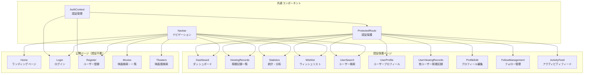
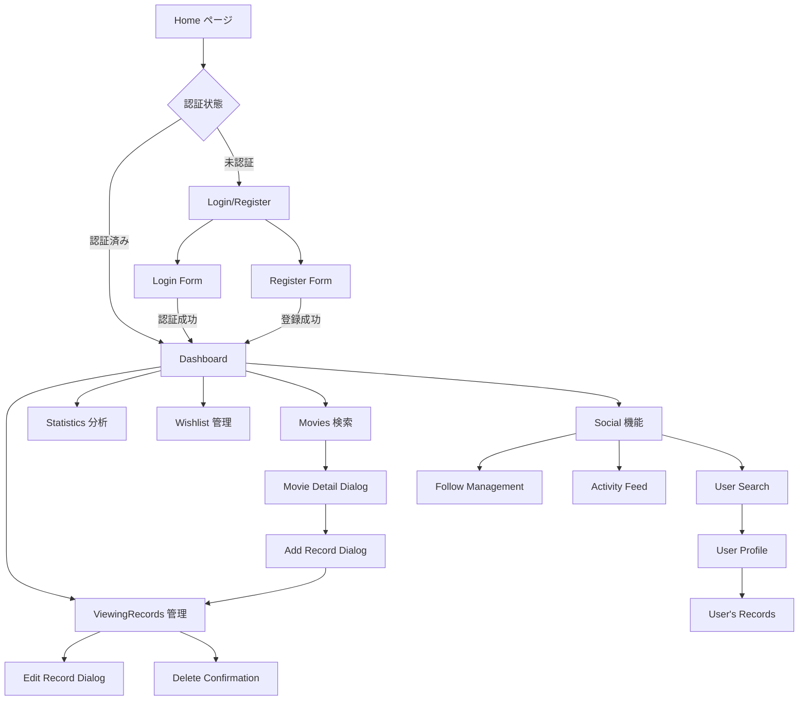
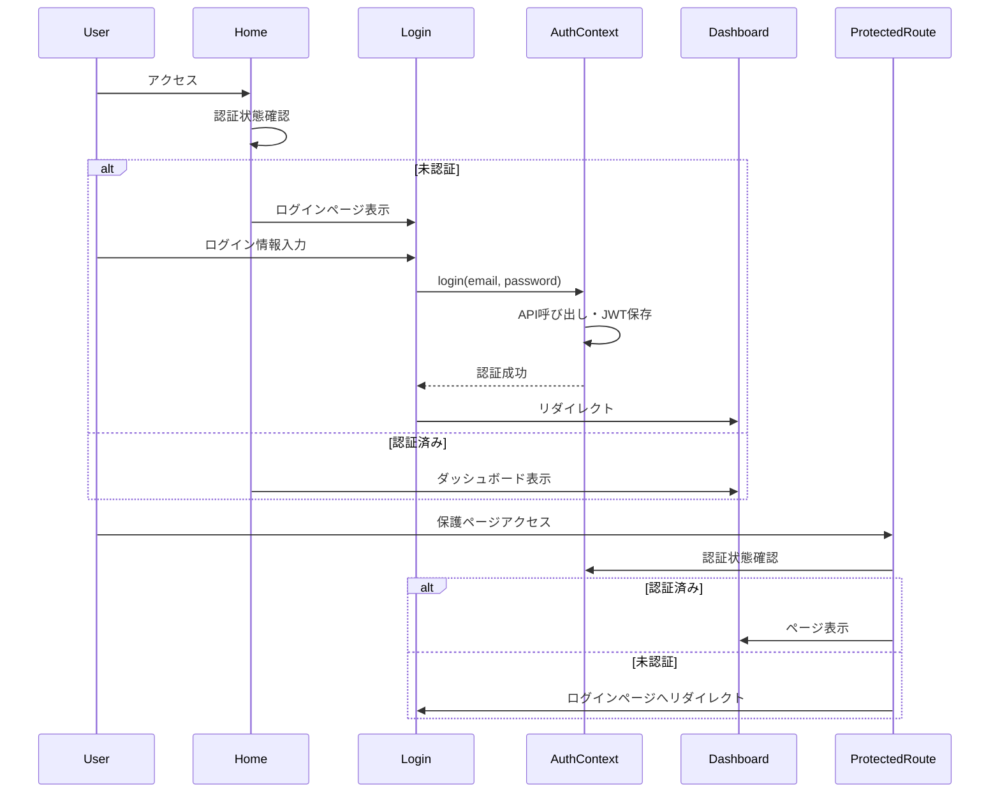
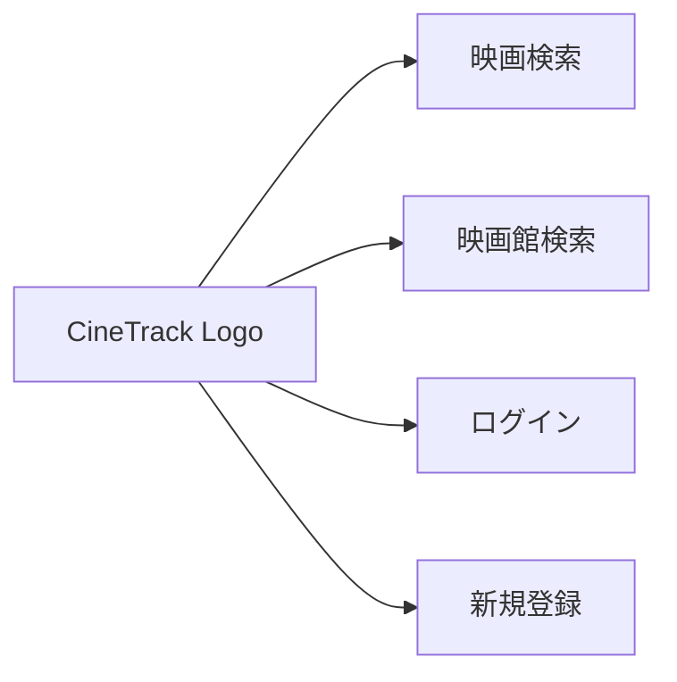
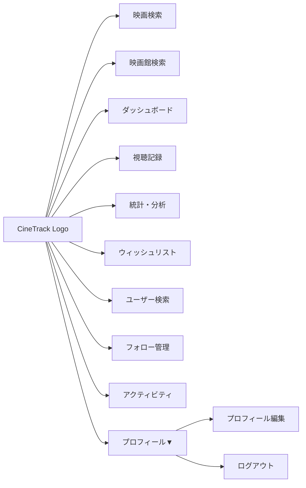

# 画面遷移図・UI設計書

## 1. 画面構成概要

### 1.1 アプリケーション全体構成



### 1.2 URL構成・ルーティング

| パス | コンポーネント | 認証 | 説明 |
|------|---------------|------|------|
| `/` | Home | 不要 | ランディングページ |
| `/login` | Login | 不要 | ログインフォーム |
| `/register` | Register | 不要 | ユーザー登録フォーム |
| `/movies` | Movies | 不要 | 映画検索・一覧 |
| `/theaters` | Theaters | 不要 | 映画館検索 |
| `/dashboard` | Dashboard | 必要 | ユーザーダッシュボード |
| `/viewing-records` | ViewingRecords | 必要 | 視聴記録管理 |
| `/statistics` | Statistics | 必要 | 統計・分析画面 |
| `/wishlist` | Wishlist | 必要 | ウィッシュリスト |
| `/users` | UserSearch | 必要 | ユーザー検索 |
| `/users/:userId` | UserProfile | 必要 | ユーザープロフィール |
| `/users/:userId/viewing-records` | UserViewingRecords | 必要 | 他ユーザー視聴記録 |
| `/profile/edit` | ProfileEdit | 必要 | プロフィール編集 |
| `/follow-management` | FollowManagement | 必要 | フォロー管理 |
| `/activity-feed` | ActivityFeed | 必要 | アクティビティフィード |

参照: `App.js:86-172`

## 2. 画面遷移フロー

### 2.1 メイン遷移フロー



### 2.2 認証フロー



## 3. 主要画面設計

### 3.1 Home ページ

**ファイル**: `Home.js` (行1-200)

#### UI構成
```
┌─────────────────────────────────────┐
│ Navbar (固定ヘッダー)                │
├─────────────────────────────────────┤
│ Hero Section                        │
│ ┌─────────────────────────────────┐ │
│ │ CineTrack ロゴ                  │ │
│ │ "映画鑑賞記録を簡単に管理"       │ │
│ │ [今すぐ始める] [ログイン]       │ │
│ └─────────────────────────────────┘ │
├─────────────────────────────────────┤
│ Trending Movies Section             │
│ ┌───┐ ┌───┐ ┌───┐ ┌───┐        │
│ │ P │ │ P │ │ P │ │ P │ 4列グリッド │
│ │ o │ │ o │ │ o │ │ o │        │
│ │ s │ │ s │ │ s │ │ s │        │
│ │ t │ │ t │ │ t │ │ t │        │
│ │ e │ │ e │ │ e │ │ e │        │
│ │ r │ │ r │ │ r │ │ r │        │
│ └───┘ └───┘ └───┘ └───┘        │
├─────────────────────────────────────┤
│ Features Section                    │
│ 📊 統計機能  🎬 記録管理  👥 ソーシャル │
└─────────────────────────────────────┘
```

#### 機能詳細
- **レスポンシブデザイン**: xs:1列, sm:2列, md:3列, lg:4列
- **ホバーエフェクト**: elevation変化・アニメーション
- **認証状態分岐**: CTAボタンの表示切り替え

### 3.2 Dashboard ページ

**ファイル**: `Dashboard.js` (行1-150)

#### UI構成
```
┌─────────────────────────────────────┐
│ Welcome Message                     │
│ "こんにちは、{username}さん！"        │
├─────────────────────────────────────┤
│ Statistics Cards (3列Grid)          │
│ ┌─────────┐ ┌─────────┐ ┌─────────┐ │
│ │📊 総視聴 │ │⭐ 平均   │ │🎬 今月  │ │
│ │  数      │ │  評価    │ │  視聴   │ │
│ │   150    │ │   4.2    │ │    12   │ │
│ └─────────┘ └─────────┘ └─────────┘ │
├─────────────────────────────────────┤
│ Recent Records Section              │
│ "最近の視聴記録"                     │
│ ┌───────────────────────────────────┐ │
│ │ Movie Card 1                    │ │
│ │ Movie Card 2                    │ │
│ │ Movie Card 3                    │ │
│ └───────────────────────────────────┘ │
├─────────────────────────────────────┤
│ Quick Actions                       │
│ [映画を記録] [統計を見る] [映画検索] │
└─────────────────────────────────────┘
```

### 3.3 Movies 検索ページ

**ファイル**: `Movies.js` (行1-400)

#### UI構成
```
┌─────────────────────────────────────┐
│ Search Bar                          │
│ ┌─────────────────────────────────┐ │
│ │ 🔍 [映画を検索...]             │ │
│ └─────────────────────────────────┘ │
├─────────────────────────────────────┤
│ Category Tabs                       │
│ [トレンド] [人気] [上映中]           │
├─────────────────────────────────────┤
│ Movies Grid (4列)                   │
│ ┌───┐ ┌───┐ ┌───┐ ┌───┐        │
│ │🎬 │ │🎬 │ │🎬 │ │🎬 │        │
│ │   │ │   │ │   │ │   │        │
│ │⭐ │ │⭐ │ │⭐ │ │⭐ │        │
│ │♡ │ │♡ │ │♡ │ │♡ │ Wishlist  │
│ │📝 │ │📝 │ │📝 │ │📝 │ Record   │
│ └───┘ └───┘ └───┘ └───┘        │
├─────────────────────────────────────┤
│ Pagination                          │
│ ← [1] [2] [3] ... [10] →           │
└─────────────────────────────────────┘
```

#### インタラクション
- **ホバーエフェクト**: カード elevation + アクションボタン表示
- **デバウンス検索**: 300ms遅延でリアルタイム検索
- **ダイアログ**: 映画詳細・記録追加・ウィッシュリスト追加

### 3.4 ViewingRecords 管理ページ

**ファイル**: `ViewingRecords.js` (行1-350)

#### UI構成
```
┌─────────────────────────────────────┐
│ Search & Filter Section             │
│ ┌─────────────────┐ ┌─────────────┐ │
│ │🔍[映画名で検索]│ │[評価で絞込] │ │
│ └─────────────────┘ └─────────────┘ │
├─────────────────────────────────────┤
│ Records Grid                        │
│ ┌─────────────────────────────────┐ │
│ │ Record Card                     │ │
│ │ ┌─────┐ Movie Title            │ │
│ │ │Post │ ⭐⭐⭐⭐⭐ (4.5)        │ │
│ │ │ er  │ 📅 2024-01-15          │ │
│ │ │     │ 🎭 TOHOシネマズ渋谷    │ │
│ │ │     │ 💬 "素晴らしい..."     │ │
│ │ └─────┘                        │ │
│ │     [編集] [削除] ⋮ More       │ │
│ └─────────────────────────────────┘ │
├─────────────────────────────────────┤
│ Pagination                          │
│ 10件中 1-10件表示 ← [1] [2] [3] → │
└─────────────────────────────────────┘
```

### 3.5 Statistics 分析ページ

**ファイル**: `Statistics.js` (行1-250)

#### UI構成（カスタム実装）
```
┌─────────────────────────────────────┐
│ Overall Stats Cards                 │
│ ┌─────────┐ ┌─────────┐ ┌─────────┐ │
│ │📊 総視聴 │ │⭐ 平均   │ │🏆 最高  │ │
│ │   150   │ │  4.2/5  │ │  評価   │ │
│ │  movies │ │ rating  │ │   5.0   │ │
│ └─────────┘ └─────────┘ └─────────┘ │
├─────────────────────────────────────┤
│ Monthly Statistics                  │
│ "月別視聴統計"                       │
│ ┌─────────────────────────────────┐ │
│ │ 1月 ████████ 8本                │ │
│ │ 2月 ████████████ 12本           │ │
│ │ 3月 ██████ 6本                  │ │
│ │ Progress Bar Style              │ │
│ └─────────────────────────────────┘ │
├─────────────────────────────────────┤
│ Genre Distribution                  │
│ "ジャンル別分析"                     │
│ ┌─────────────────────────────────┐ │
│ │ アクション ████████████ 45%      │ │
│ │ ドラマ     ████████ 30%         │ │
│ │ コメディ   ████ 15%             │ │
│ │ ホラー     ██ 10%               │ │
│ └─────────────────────────────────┘ │
├─────────────────────────────────────┤
│ Rating Distribution                 │
│ "評価分布"                          │
│ ⭐⭐⭐⭐⭐ ████████ 40%             │
│ ⭐⭐⭐⭐   ██████ 30%               │
│ ⭐⭐⭐     ████ 20%                 │
│ ⭐⭐       ██ 10%                   │
└─────────────────────────────────────┘
```

## 4. ナビゲーション設計

### 4.1 Navbar コンポーネント

**ファイル**: `Navbar.js` (行1-200)

#### デスクトップ表示
```
┌─────────────────────────────────────────────────────────┐
│ CineTrack | [映画] [映画館] [ダッシュボード] [記録] [統計] [ユーザー] │ Avatar▼ │
└─────────────────────────────────────────────────────────┘
```

#### モバイル表示
```
┌─────────────────────────────────┐
│ ☰ CineTrack           Avatar▼ │
└─────────────────────────────────┘
│ Drawer Menu (左から表示)         │
│ ┌─────────────────────────────┐ │
│ │ 🎬 映画検索                │ │
│ │ 🏛️ 映画館検索              │ │
│ │ ────────────────────────── │ │
│ │ 📊 ダッシュボード           │ │
│ │ 📝 視聴記録               │ │
│ │ 📈 統計・分析             │ │
│ │ ♡ ウィッシュリスト         │ │
│ │ 👥 ユーザー検索           │ │
│ │ 📢 アクティビティ         │ │
│ └─────────────────────────────┘ │
```

### 4.2 認証状態別メニュー

#### 未認証時メニュー


#### 認証済みメニュー


## 5. ダイアログ・モーダル設計

### 5.1 映画詳細ダイアログ

```
┌─────────────────────────────────────┐
│ Movie Detail Dialog            ✕   │
├─────────────────────────────────────┤
│ ┌─────┐ Movie Title                │
│ │Post │ ⭐⭐⭐⭐⭐ (8.5) TMDb       │
│ │ er  │ 🗓️ 2024-05-01              │
│ │     │ ⏱️ 143分                    │
│ │     │ 🎭 アクション・アドベンチャー │
│ └─────┘                            │
├─────────────────────────────────────┤
│ Overview                            │
│ "地球最強のヒーローチームが..."       │
├─────────────────────────────────────┤
│ Actions                             │
│ [♡ ウィッシュリストに追加]            │
│ [📝 視聴記録を追加]                 │
│ [キャンセル]                        │
└─────────────────────────────────────┘
```

### 5.2 視聴記録追加ダイアログ

```
┌─────────────────────────────────────┐
│ Add Viewing Record             ✕   │
├─────────────────────────────────────┤
│ Movie: アベンジャーズ                │
├─────────────────────────────────────┤
│ ⭐ Rating (必須)                   │
│ ⭐⭐⭐⭐⭐ [スライダー]              │
├─────────────────────────────────────┤
│ 📅 Viewing Date (必須)             │
│ [2024-01-15] [19:30]               │
├─────────────────────────────────────┤
│ 🎭 Theater (任意)                  │
│ [TOHOシネマズ渋谷▼] [🔍 検索]      │
├─────────────────────────────────────┤
│ 📱 Screening Format (任意)         │
│ [IMAX▼] [2D/3D/4DX/DOLBY等]       │
├─────────────────────────────────────┤
│ 💬 Review (任意)                   │
│ ┌─────────────────────────────────┐ │
│ │ 感想を書いてください...          │ │
│ │                                │ │
│ │                                │ │
│ └─────────────────────────────────┘ │
├─────────────────────────────────────┤
│      [キャンセル]    [記録を保存]     │
└─────────────────────────────────────┘
```

### 5.3 劇場検索ダイアログ

```
┌─────────────────────────────────────┐
│ Theater Search                 ✕   │
├─────────────────────────────────────┤
│ 🔍 [劇場名・チェーン・場所で検索]     │
├─────────────────────────────────────┤
│ Filters                             │
│ 都道府県: [東京都▼] 市区町村: [渋谷区▼] │
│ チェーン: [TOHOシネマズ▼]            │
├─────────────────────────────────────┤
│ Results (Scrollable List)           │
│ ┌─────────────────────────────────┐ │
│ │ 📍 TOHOシネマズ渋谷              │ │
│ │    渋谷スカイ内                 │ │
│ │    東京都渋谷区渋谷2-24-1        │ │
│ │                      [選択]     │ │
│ ├─────────────────────────────────┤ │
│ │ 📍 新宿ピカデリー               │ │
│ │    新宿3-15-15                 │ │
│ │                      [選択]     │ │
│ └─────────────────────────────────┘ │
├─────────────────────────────────────┤
│         [キャンセル]    [選択完了]    │
└─────────────────────────────────────┘
```

## 6. レスポンシブデザイン

### 6.1 ブレークポイント設定

| サイズ | 幅 | 列数 | フォント | 間隔 |
|--------|----|----|--------|------|
| xs | 0-599px | 1列 | 14px | 8px |
| sm | 600-899px | 2列 | 16px | 12px |
| md | 900-1199px | 3列 | 18px | 16px |
| lg | 1200-1535px | 4列 | 20px | 20px |
| xl | 1536px+ | 4-6列 | 22px | 24px |

### 6.2 モバイル最適化

#### タッチ操作対応
- **ボタンサイズ**: 最小44px × 44px
- **タップ領域**: 十分な間隔確保
- **スワイプ操作**: ドロワーメニュー・カルーセル

#### レイアウト調整
```javascript
// Grid responsive設定例
<Grid container spacing={{ xs: 1, sm: 2, md: 3 }}>
  <Grid item xs={12} sm={6} md={4} lg={3}>
    {/* Movie Card */}
  </Grid>
</Grid>

// Typography responsive
<Typography 
  variant="h4" 
  sx={{ 
    fontSize: { xs: '1.5rem', sm: '2rem', md: '2.5rem' } 
  }}
>
```

## 7. UI/UXデザインガイドライン

### 7.1 カラーパレット

```javascript
// Netflix風ダークテーマ
const theme = createTheme({
  palette: {
    mode: 'dark',
    primary: {
      main: '#e50914',    // Netflix Red
      dark: '#b7070f',
    },
    secondary: {
      main: '#f40612',
      dark: '#c4050e',
    },
    background: {
      default: '#141414', // Dark Background
      paper: '#1f1f1f',   // Card Background
    },
    text: {
      primary: '#ffffff',   // White Text
      secondary: '#b3b3b3', // Gray Text
    }
  }
});
```

### 7.2 コンポーネントスタイル

#### カード設計
```javascript
// Hover効果付きカード
<Card 
  sx={{
    transition: 'all 0.3s ease-in-out',
    '&:hover': {
      transform: 'translateY(-4px)',
      boxShadow: 6,
    }
  }}
>
```

#### ボタン設計
```javascript
// Primary Action Button
<Button 
  variant="contained" 
  size="large"
  sx={{
    borderRadius: 2,
    textTransform: 'none',
    fontWeight: 600,
  }}
>
```

### 7.3 アニメーション

#### フェードイン効果
```javascript
// ページ遷移アニメーション
<Slide direction="up" in={true} mountOnEnter unmountOnExit>
  <Container>
    {/* Page Content */}
  </Container>
</Slide>
```

#### ローディングアニメーション
```javascript
// CircularProgress with backdrop
<Backdrop open={loading} sx={{ zIndex: 1301 }}>
  <CircularProgress color="primary" />
</Backdrop>
```

## 8. アクセシビリティ対応

### 8.1 Material-UI標準対応

- **キーボードナビゲーション**: Tab順序・Focus管理
- **スクリーンリーダー**: aria-label・aria-describedby
- **コントラスト**: WCAG AA準拠
- **フォントサイズ**: 最小14px・拡大対応

### 8.2 セマンティックHTML

```html
<!-- 適切な見出し構造 -->
<main>
  <h1>映画検索</h1>
  <section>
    <h2>検索結果</h2>
    <article>
      <h3>映画タイトル</h3>
    </article>
  </section>
</main>
```

### 8.3 フォーカス管理

```javascript
// ダイアログオープン時のフォーカス
const handleDialogOpen = () => {
  setOpen(true);
  setTimeout(() => {
    firstInputRef.current?.focus();
  }, 100);
};
```

## 9. パフォーマンス最適化

### 9.1 遅延読み込み

```javascript
// React.lazy による動的インポート
const Dashboard = lazy(() => import('./pages/Dashboard'));
const Movies = lazy(() => import('./pages/Movies'));

// Suspense でローディング表示
<Suspense fallback={<CircularProgress />}>
  <Routes>
    <Route path="/dashboard" element={<Dashboard />} />
  </Routes>
</Suspense>
```

### 9.2 画像最適化

```javascript
// LazyLoadingイメージ

```

### 9.3 仮想化対応

```javascript
// 大量データのメモ化
const MemoizedMovieCard = React.memo(MovieCard, (prevProps, nextProps) => {
  return prevProps.movie.id === nextProps.movie.id;
});
```

---

**作成日**: 2025-07-23  
**対象バージョン**: cineTrack v1.0  
**更新履歴**: 初版作成  
**参照ファイル**: 
- `App.js` - ルーティング設定
- `Navbar.js` - ナビゲーション
- `Home.js`, `Dashboard.js`, `Movies.js` 等 - 各ページコンポーネント
- `ProtectedRoute.js` - 認証保護
- `AuthContext.js` - 認証状態管理