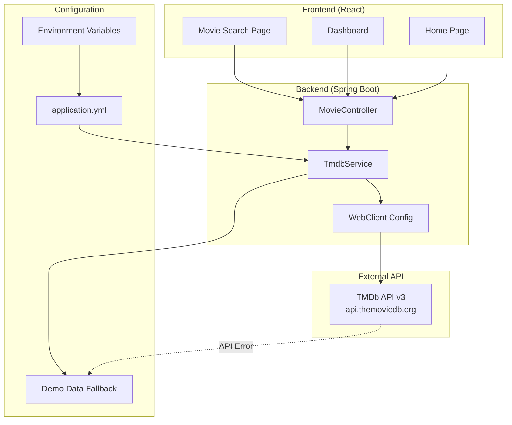
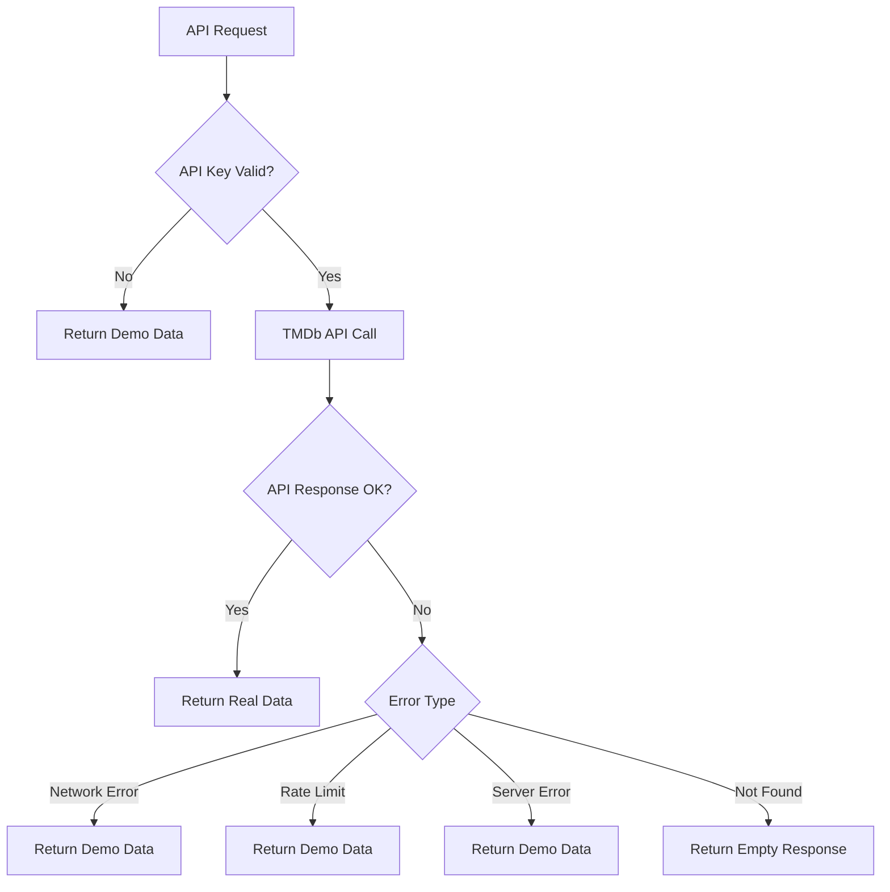

# 外部API連携設計書

## 1. 外部API連携概要

### 1.1 連携先API

| API名 | 用途 | バージョン | 認証方式 |
|-------|------|-----------|----------|
| TMDb API | 映画情報取得 | v3 | APIキー認証 |

### 1.2 連携アーキテクチャ



## 2. TMDb API連携詳細

### 2.1 基本情報

| 項目 | 値 |
|------|---|
| Base URL | https://api.themoviedb.org/3 |
| 認証方式 | APIキー (クエリパラメータ) |
| データ形式 | JSON |
| レート制限 | 40リクエスト/10秒 |
| 言語設定 | ja-JP (日本語) |
| 地域設定 | JP (日本) |

参照: `application.yml:41-44`, `TmdbService.java:23-24`

### 2.2 連携エンドポイント一覧

| 機能 | TMDb エンドポイント | 内部API | 実装メソッド |
|------|-------------------|---------|-------------|
| トレンド映画 | `/trending/movie/{time_window}` | `GET /movies/trending` | `getTrendingMovies()` |
| 映画詳細 | `/movie/{movie_id}` | `GET /movies/{movieId}` | `getMovieDetails()` |
| 映画検索 | `/search/movie` | `GET /movies/search` | `searchMovies()` |
| 人気映画 | `/movie/popular` | `GET /movies/popular` | `getPopularMovies()` |
| 現在上映中 | `/movie/now_playing` | `GET /movies/now-playing` | `getNowPlayingMovies()` |

参照: `TmdbService.java:26-123`, `MovieController.java:20-85`

## 3. 実装詳細

### 3.1 TmdbService 実装

**ファイル**: `TmdbService.java`

```java
@Service
public class TmdbService {
    
    @Value("${tmdb.api-key}")
    private String apiKey;
    
    @Qualifier("tmdbWebClient")
    private final WebClient tmdbWebClient;
    
    // トレンド映画取得
    public Mono<TmdbMovieListResponse> getTrendingMovies(String timeWindow, Integer page) {
        // APIキー検証
        if (!isValidApiKey()) {
            return Mono.just(createDemoMovieResponse());
        }
        
        return tmdbWebClient
            .get()
            .uri(uriBuilder -> uriBuilder
                .path("/trending/movie/{time_window}")
                .queryParam("api_key", apiKey)
                .queryParam("language", "ja-JP")
                .queryParam("page", page != null ? page : 1)
                .build(timeWindow))
            .retrieve()
            .bodyToMono(TmdbMovieListResponse.class)
            .onErrorReturn(createDemoMovieResponse());
    }
}
```

参照: `TmdbService.java:26-45`

### 3.2 WebClient設定

**ファイル**: `WebClientConfig.java`

```java
@Configuration
public class WebClientConfig {
    
    @Value("${tmdb.base-url}")
    private String tmdbBaseUrl;
    
    @Bean("tmdbWebClient")
    public WebClient tmdbWebClient() {
        return WebClient.builder()
            .baseUrl(tmdbBaseUrl)
            .defaultHeader("accept", "application/json")
            .codecs(configurer -> configurer
                .defaultCodecs()
                .maxInMemorySize(1024 * 1024)) // 1MB
            .build();
    }
}
```

参照: `WebClientConfig.java:14-20`

### 3.3 MovieController 実装

```java
@RestController
@RequestMapping("/movies")
public class MovieController {
    
    private final TmdbService tmdbService;
    
    @GetMapping("/trending")
    public Mono<ResponseEntity<ApiResponse<TmdbMovieListResponse>>> getTrendingMovies(
            @RequestParam(defaultValue = "day") String timeWindow,
            @RequestParam(defaultValue = "1") Integer page) {
        
        return tmdbService.getTrendingMovies(timeWindow, page)
            .map(response -> ResponseEntity.ok(
                ApiResponse.success("Trending movies retrieved successfully", response)))
            .onErrorReturn(ResponseEntity.internalServerError()
                .body(ApiResponse.error("Failed to fetch trending movies")));
    }
}
```

参照: `MovieController.java:20-31`

## 4. データ転送オブジェクト（DTO）設計

### 4.1 TmdbMovieDto 構造

**ファイル**: `TmdbMovieDto.java` (行8-182)

```java
public class TmdbMovieDto {
    private Long id;
    private String title;
    
    @JsonProperty("original_title")
    private String originalTitle;
    
    private String overview;
    
    @JsonProperty("release_date")
    private String releaseDate;
    
    @JsonProperty("poster_path")
    private String posterPath;
    
    @JsonProperty("backdrop_path")
    private String backdropPath;
    
    @JsonProperty("vote_average")
    private Double voteAverage;
    
    @JsonProperty("vote_count")
    private Integer voteCount;
    
    private Boolean adult;
    
    @JsonProperty("genre_ids")
    private List<Integer> genreIds;
    
    private Double popularity;
    
    @JsonProperty("original_language")
    private String originalLanguage;
    
    // 詳細情報取得時のみ
    private Integer runtime;
    private List<TmdbGenreDto> genres;
    
    @JsonProperty("production_companies")
    private List<TmdbProductionCompanyDto> productionCompanies;
}
```

### 4.2 TmdbMovieListResponse 構造

```java
public class TmdbMovieListResponse {
    private Integer page;
    private List<TmdbMovieDto> results;
    
    @JsonProperty("total_pages")
    private Integer totalPages;
    
    @JsonProperty("total_results")
    private Integer totalResults;
}
```

参照: `TmdbMovieListResponse.java:7-52`

### 4.3 サブDTO構造

#### TmdbGenreDto
```java
public class TmdbGenreDto {
    private Integer id;
    private String name;
}
```

#### TmdbProductionCompanyDto
```java
public class TmdbProductionCompanyDto {
    private Integer id;
    private String name;
    
    @JsonProperty("logo_path")
    private String logoPath;
    
    @JsonProperty("origin_country")
    private String originCountry;
}
```

## 5. APIリクエスト仕様

### 5.1 共通パラメータ

| パラメータ | 値 | 説明 |
|------------|----|----|
| api_key | {API_KEY} | TMDb APIキー |
| language | ja-JP | 日本語対応 |
| page | 1-1000 | ページ番号 |

### 5.2 エンドポイント別パラメータ

#### トレンド映画 (`/trending/movie/{time_window}`)
```
GET https://api.themoviedb.org/3/trending/movie/day
?api_key={API_KEY}
&language=ja-JP
&page=1
```

#### 映画検索 (`/search/movie`)
```
GET https://api.themoviedb.org/3/search/movie
?api_key={API_KEY}
&language=ja-JP
&query={検索キーワード}
&page=1
&include_adult=false
```

#### 現在上映中 (`/movie/now_playing`)
```
GET https://api.themoviedb.org/3/movie/now_playing
?api_key={API_KEY}
&language=ja-JP
&page=1
&region=JP
```

## 6. レスポンス例

### 6.1 映画一覧レスポンス

```json
{
  "page": 1,
  "results": [
    {
      "id": 299536,
      "title": "アベンジャーズ/インフィニティ・ウォー",
      "original_title": "Avengers: Infinity War",
      "overview": "アベンジャーズが最強の敵サノスに立ち向かう...",
      "release_date": "2018-04-25",
      "poster_path": "/7WsyChQLEftFiDOVTGkv3hFpyyt.jpg",
      "backdrop_path": "/bOGkgRGdhrBYJSLpXaxhXVstddV.jpg",
      "vote_average": 8.3,
      "vote_count": 28000,
      "adult": false,
      "genre_ids": [12, 878, 28],
      "popularity": 150.5,
      "original_language": "en"
    }
  ],
  "total_pages": 500,
  "total_results": 10000
}
```

### 6.2 映画詳細レスポンス

```json
{
  "id": 299536,
  "title": "アベンジャーズ/インフィニティ・ウォー",
  "runtime": 149,
  "genres": [
    {"id": 12, "name": "アドベンチャー"},
    {"id": 878, "name": "サイエンスフィクション"},
    {"id": 28, "name": "アクション"}
  ],
  "production_companies": [
    {
      "id": 420,
      "name": "Marvel Studios",
      "logo_path": "/hUzeosd33nzE5MCNsZxCGEKTXaQ.png",
      "origin_country": "US"
    }
  ]
}
```

## 7. エラーハンドリング・フォールバック

### 7.1 エラーハンドリング戦略



### 7.2 デモデータ実装

**メソッド**: `createDemoMovieResponse()` (行140-192)

```java
private TmdbMovieListResponse createDemoMovieResponse() {
    List<TmdbMovieDto> demoMovies = Arrays.asList(
        // アベンジャーズ/エンドゲーム
        createDemoMovie(299534L, "アベンジャーズ/エンドゲーム", 
            "Avengers: Endgame", "2019-04-24", 8.4, 28000),
        
        // 君の名は。
        createDemoMovie(372058L, "君の名は。", 
            "Your Name.", "2016-08-26", 8.2, 15000),
        
        // 千と千尋の神隠し
        createDemoMovie(129L, "千と千尋の神隠し", 
            "Spirited Away", "2001-07-20", 9.3, 25000)
    );
    
    return TmdbMovieListResponse.builder()
        .page(1)
        .results(demoMovies)
        .totalPages(1)
        .totalResults(3)
        .build();
}
```

### 7.3 APIキー検証

```java
private boolean isValidApiKey() {
    return apiKey != null && 
           !apiKey.isEmpty() && 
           !apiKey.equals("demo_api_key_please_replace_with_actual_key");
}
```

参照: `TmdbService.java:29-32`

## 8. 画像URL管理

### 8.1 画像URL生成サービス

```java
public class TmdbService {
    
    private static final String IMAGE_BASE_URL = "https://image.tmdb.org/t/p/";
    
    public String getImageUrl(String imagePath, String size) {
        if (imagePath == null || imagePath.trim().isEmpty()) {
            return null;
        }
        return IMAGE_BASE_URL + size + imagePath;
    }
    
    public String getPosterUrl(String posterPath) {
        return getImageUrl(posterPath, "w500");      // 500px幅
    }
    
    public String getBackdropUrl(String backdropPath) {
        return getImageUrl(backdropPath, "w1280");   // 1280px幅
    }
    
    public String getThumbnailUrl(String posterPath) {
        return getImageUrl(posterPath, "w185");      // 185px幅（サムネイル用）
    }
}
```

参照: `TmdbService.java:125-138`

### 8.2 利用可能な画像サイズ

| タイプ | 利用可能サイズ | 推奨用途 |
|--------|---------------|----------|
| poster | w92, w154, w185, w342, w500, w780, original | ポスター画像 |
| backdrop | w300, w780, w1280, original | 背景画像 |
| logo | w45, w92, w154, w185, w300, w500, original | ロゴ画像 |

## 9. フロントエンド連携

### 9.1 API呼び出し実装

**ファイル**: `Movies.js`

```javascript
const API_BASE_URL = process.env.REACT_APP_API_BASE_URL || 'http://localhost:8080/api';

// トレンド映画取得
const fetchTrendingMovies = async (page = 1) => {
  try {
    const response = await axios.get(
      `${API_BASE_URL}/movies/trending?timeWindow=day&page=${page}`
    );
    return response.data.data; // ApiResponse.data
  } catch (error) {
    console.error('Error fetching trending movies:', error);
    throw error;
  }
};

// 映画検索
const searchMovies = async (query, page = 1) => {
  try {
    const response = await axios.get(
      `${API_BASE_URL}/movies/search?query=${encodeURIComponent(query)}&page=${page}`
    );
    return response.data.data;
  } catch (error) {
    console.error('Error searching movies:', error);
    throw error;
  }
};
```

### 9.2 画像URL生成

```javascript
// 画像URL生成ヘルパー
const getImageUrl = (posterPath, size = 'w500') => {
  if (!posterPath) return '/placeholder-movie.jpg';
  return `https://image.tmdb.org/t/p/${size}${posterPath}`;
};

// コンポーネントでの使用例

```

## 10. 設定管理

### 10.1 環境変数設定

**ファイル**: `application.yml` (行41-44)

```yaml
tmdb:
  api-key: ${TMDB_API_KEY:demo_api_key_please_replace_with_actual_key}
  base-url: ${TMDB_BASE_URL:https://api.themoviedb.org/3}
```

**ファイル**: `.env.example` (行13-14)

```bash
# TMDb API Configuration
TMDB_API_KEY=your_tmdb_api_key_here
TMDB_BASE_URL=https://api.themoviedb.org/3
```

### 10.2 本番環境設定

```bash
# 本番環境での環境変数設定
export TMDB_API_KEY="your_actual_tmdb_api_key"
export TMDB_BASE_URL="https://api.themoviedb.org/3"
```

## 11. パフォーマンス最適化

### 11.1 非同期処理

```java
// WebFlux Monoによる非同期処理
public Mono<TmdbMovieListResponse> getTrendingMovies(String timeWindow, Integer page) {
    return tmdbWebClient
        .get()
        .uri(/* URI Builder */)
        .retrieve()
        .bodyToMono(TmdbMovieListResponse.class)
        .timeout(Duration.ofSeconds(10))  // タイムアウト設定
        .onErrorReturn(createDemoMovieResponse());
}
```

### 11.2 将来のキャッシュ実装

```java
// Spring Cache による実装例（将来実装予定）
@Cacheable(value = "movies", key = "#timeWindow + '_' + #page")
public Mono<TmdbMovieListResponse> getTrendingMovies(String timeWindow, Integer page) {
    // 既存実装
}

@CacheEvict(value = "movies", allEntries = true)
@Scheduled(fixedRate = 1800000) // 30分毎にキャッシュクリア
public void evictMoviesCache() {
    logger.info("Movies cache cleared");
}
```

### 11.3 リクエスト最適化

```java
// 接続プール・タイムアウト設定
@Bean("tmdbWebClient")
public WebClient tmdbWebClient() {
    ConnectionProvider connectionProvider = ConnectionProvider.builder("tmdb")
        .maxConnections(50)
        .maxIdleTime(Duration.ofSeconds(20))
        .maxLifeTime(Duration.ofSeconds(60))
        .build();
        
    HttpClient httpClient = HttpClient.create(connectionProvider)
        .responseTimeout(Duration.ofSeconds(10))
        .keepAlive(true);
        
    return WebClient.builder()
        .baseUrl(tmdbBaseUrl)
        .clientConnector(new ReactorClientHttpConnector(httpClient))
        .build();
}
```

## 12. テスト戦略

### 12.1 単体テスト

**ファイル**: `TmdbServiceTest.java` (47テストケース)

```java
@ExtendWith(MockitoExtension.class)
class TmdbServiceTest {
    
    @Test
    void getTrendingMovies_ValidApiKey_ReturnsMovieList() {
        // given
        String timeWindow = "day";
        Integer page = 1;
        
        // when
        Mono<TmdbMovieListResponse> result = tmdbService.getTrendingMovies(timeWindow, page);
        
        // then
        StepVerifier.create(result)
            .expectNextMatches(response -> 
                response.getResults() != null && 
                response.getResults().size() > 0)
            .verifyComplete();
    }
    
    @Test
    void getTrendingMovies_InvalidApiKey_ReturnsDemoData() {
        // APIキー無効時のテスト
    }
}
```

### 12.2 統合テスト

**ファイル**: `MovieControllerTest.java` (17テストケース)

```java
@SpringBootTest
@AutoConfigureTestDatabase(replace = AutoConfigureTestDatabase.Replace.NONE)
class MovieControllerTest {
    
    @Test
    void getTrendingMovies_Success() throws Exception {
        mockMvc.perform(get("/movies/trending")
                .param("timeWindow", "day")
                .param("page", "1"))
            .andExpect(status().isOk())
            .andExpect(jsonPath("$.success").value(true))
            .andExpect(jsonPath("$.data.results").isArray());
    }
}
```

## 13. 監視・ログ

### 13.1 ログ実装

```java
private static final Logger logger = LoggerFactory.getLogger(TmdbService.class);

public Mono<TmdbMovieListResponse> getTrendingMovies(String timeWindow, Integer page) {
    logger.info("Fetching trending movies: timeWindow={}, page={}", timeWindow, page);
    
    if (!isValidApiKey()) {
        logger.warn("Invalid API key detected, returning demo data");
        return Mono.just(createDemoMovieResponse());
    }
    
    return tmdbWebClient.get()
        // ... 実装
        .doOnSuccess(response -> logger.info("Successfully fetched {} movies", 
            response.getResults().size()))
        .doOnError(error -> logger.error("Error fetching trending movies", error));
}
```

### 13.2 メトリクス（将来実装予定）

```java
// Micrometer メトリクス
@Component
public class TmdbMetrics {
    
    private final Counter apiCallCounter;
    private final Timer apiCallTimer;
    
    public TmdbMetrics(MeterRegistry meterRegistry) {
        this.apiCallCounter = Counter.builder("tmdb.api.calls")
            .description("TMDb API call count")
            .register(meterRegistry);
            
        this.apiCallTimer = Timer.builder("tmdb.api.duration")
            .description("TMDb API call duration")
            .register(meterRegistry);
    }
}
```

## 14. 将来の拡張予定

### 14.1 他API連携準備

```java
// 汎用APIサービス基底クラス
@Service
public abstract class ExternalApiService {
    
    protected abstract WebClient getWebClient();
    protected abstract String getApiKey();
    protected abstract boolean isValidApiKey();
    
    protected <T> Mono<T> executeRequest(String path, Class<T> responseType) {
        if (!isValidApiKey()) {
            return Mono.error(new ApiKeyInvalidException());
        }
        
        return getWebClient()
            .get()
            .uri(path)
            .retrieve()
            .bodyToMono(responseType)
            .timeout(Duration.ofSeconds(10));
    }
}
```

### 14.2 キャッシュ戦略

```java
// Redis キャッシュ実装予定
@Configuration
@EnableCaching
public class CacheConfig {
    
    @Bean
    public CacheManager cacheManager() {
        RedisCacheManager.Builder builder = RedisCacheManager
            .RedisCacheManagerBuilder
            .fromConnectionFactory(redisConnectionFactory())
            .cacheDefaults(cacheConfiguration());
            
        return builder.build();
    }
    
    private RedisCacheConfiguration cacheConfiguration() {
        return RedisCacheConfiguration.defaultCacheConfig()
            .entryTtl(Duration.ofMinutes(30))  // 30分キャッシュ
            .serializeKeysWith(RedisSerializationContext.SerializationPair
                .fromSerializer(new StringRedisSerializer()))
            .serializeValuesWith(RedisSerializationContext.SerializationPair
                .fromSerializer(new GenericJackson2JsonRedisSerializer()));
    }
}
```

---

**作成日**: 2025-07-23  
**対象バージョン**: cineTrack v1.0  
**更新履歴**: 初版作成  
**参照ファイル**: 
- `TmdbService.java` - TMDb API連携サービス
- `WebClientConfig.java` - WebClient設定
- `MovieController.java` - 映画情報API
- `TmdbMovieDto.java` - データ転送オブジェクト
- `application.yml` - 設定管理