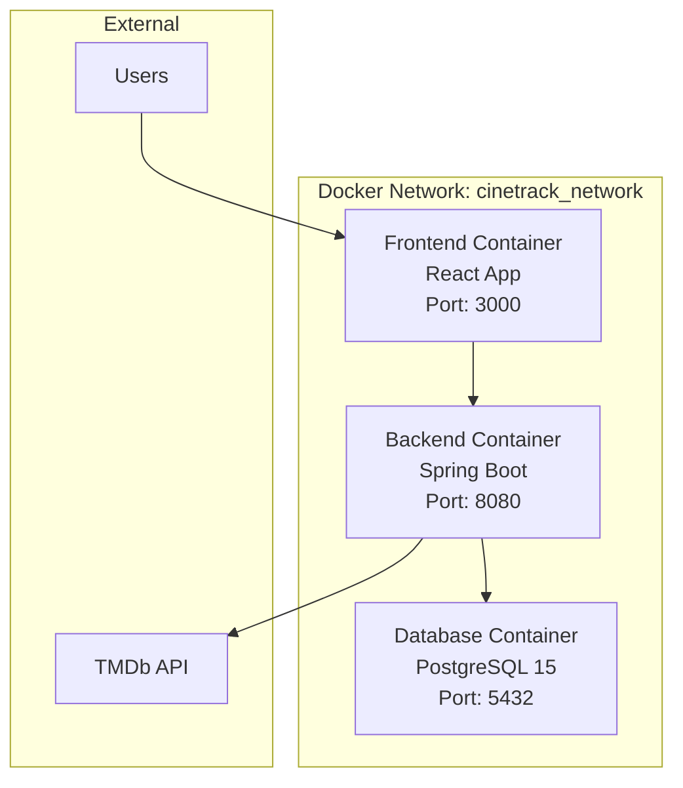

# デプロイメント設計書

## 1. デプロイメント概要

### 1.1 デプロイメント戦略
- **コンテナ化**: Docker Compose を使用したマルチコンテナアプリケーション
- **環境構成**: 開発・ステージング・本番環境の分離
- **CI/CD**: GitHubアクションを想定した自動デプロイメント

### 1.2 インフラ構成
- **アプリケーションサーバー**: Spring Boot アプリケーション (Port 8080)
- **ウェブサーバー**: React アプリケーション (Port 3000)
- **データベースサーバー**: PostgreSQL 15 (Port 5432)
- **リバースプロキシ**: Nginx (本番環境想定)

## 2. コンテナ構成

### 2.1 Dockerコンテナ構成


### 2.2 コンテナ詳細

#### 2.2.1 Frontend Container
```dockerfile
# 本番用 Dockerfile (想定)
FROM node:18-alpine as build
WORKDIR /app
COPY package*.json ./
RUN npm ci --only=production
COPY . .
RUN npm run build

FROM nginx:alpine
COPY --from=build /app/build /usr/share/nginx/html
COPY nginx.conf /etc/nginx/nginx.conf
EXPOSE 80
```

#### 2.2.2 Backend Container
```dockerfile
FROM openjdk:17-jdk-slim
WORKDIR /app
COPY mvnw .
COPY .mvn .mvn
COPY pom.xml .
RUN ./mvnw dependency:go-offline -B
COPY src src
RUN ./mvnw clean package -DskipTests
EXPOSE 8080
CMD ["java", "-jar", "target/cinetrack-backend-0.0.1-SNAPSHOT.jar"]
```

#### 2.2.3 Database Container
```yaml
db:
  image: postgres:15
  environment:
    POSTGRES_DB: cinetrack
    POSTGRES_USER: cinetrack_user
    POSTGRES_PASSWORD: secure_password
  volumes:
    - postgres_data:/var/lib/postgresql/data
    - ./backend/src/main/resources/db/migration:/docker-entrypoint-initdb.d
```

## 3. 環境別構成

### 3.1 開発環境 (Development)
```yaml
# docker-compose.dev.yml
version: '3.8'
services:
  db:
    ports:
      - "5432:5432"
  backend:
    environment:
      SPRING_PROFILES_ACTIVE: dev
    ports:
      - "8080:8080"
    volumes:
      - ./backend:/app
  frontend:
    ports:
      - "3000:3000"
    volumes:
      - ./frontend:/app
      - /app/node_modules
```

### 3.2 ステージング環境 (Staging)
```yaml
# docker-compose.staging.yml
version: '3.8'
services:
  nginx:
    image: nginx:alpine
    ports:
      - "80:80"
      - "443:443"
    volumes:
      - ./nginx/staging.conf:/etc/nginx/nginx.conf
      - ./ssl:/etc/ssl/certs
  backend:
    environment:
      SPRING_PROFILES_ACTIVE: staging
  frontend:
    environment:
      REACT_APP_API_BASE_URL: https://staging-api.cinetrack.com/api
```

### 3.3 本番環境 (Production)
```yaml
# docker-compose.prod.yml
version: '3.8'
services:
  nginx:
    image: nginx:alpine
    ports:
      - "80:80"
      - "443:443"
    volumes:
      - ./nginx/prod.conf:/etc/nginx/nginx.conf
      - ./ssl:/etc/ssl/certs
      - ./logs:/var/log/nginx
    restart: always
  backend:
    environment:
      SPRING_PROFILES_ACTIVE: prod
    restart: always
  frontend:
    environment:
      REACT_APP_API_BASE_URL: https://api.cinetrack.com/api
    restart: always
  db:
    volumes:
      - postgres_prod_data:/var/lib/postgresql/data
    restart: always
```

## 4. 環境変数管理

### 4.1 環境変数一覧
```bash
# データベース設定
POSTGRES_DB=cinetrack
POSTGRES_USER=cinetrack_user
POSTGRES_PASSWORD=${SECRET_DB_PASSWORD}

# Spring Boot設定
SPRING_DATASOURCE_URL=jdbc:postgresql://db:5432/cinetrack
SPRING_DATASOURCE_USERNAME=${POSTGRES_USER}
SPRING_DATASOURCE_PASSWORD=${POSTGRES_PASSWORD}
SPRING_PROFILES_ACTIVE=prod

# JWT設定
JWT_SECRET=${SECRET_JWT_KEY}
JWT_EXPIRATION=86400

# TMDb API設定
TMDB_API_KEY=${SECRET_TMDB_API_KEY}
TMDB_BASE_URL=https://api.themoviedb.org/3

# React設定
REACT_APP_API_BASE_URL=https://api.cinetrack.com/api

# CORS設定
CORS_ALLOWED_ORIGINS=https://cinetrack.com

# SSL設定
SSL_CERT_PATH=/etc/ssl/certs/cinetrack.crt
SSL_KEY_PATH=/etc/ssl/private/cinetrack.key
```

### 4.2 秘匿情報管理
```bash
# .env.production (Git管理対象外)
POSTGRES_PASSWORD=<SECURE_DB_PASSWORD>
JWT_SECRET=<256_BIT_JWT_SECRET>
TMDB_API_KEY=<TMDB_API_KEY>
SSL_CERT_PASSWORD=<SSL_CERT_PASSWORD>

# Docker Secrets (推奨)
echo "secure_db_password" | docker secret create db_password -
echo "secure_jwt_secret" | docker secret create jwt_secret -
```

## 5. ネットワーク設計

### 5.1 ネットワーク構成
```yaml
networks:
  cinetrack_network:
    driver: bridge
    ipam:
      config:
        - subnet: 172.20.0.0/16
  
  db_network:
    driver: bridge
    internal: true  # DBアクセスを内部のみに制限
```

### 5.2 ポート設計
| Service | Internal Port | External Port | Protocol | Purpose |
|---------|---------------|---------------|----------|---------|
| Nginx | 80, 443 | 80, 443 | HTTP/HTTPS | リバースプロキシ |
| Frontend | 3000 | - | HTTP | React Dev Server |
| Backend | 8080 | - | HTTP | Spring Boot API |
| Database | 5432 | - | TCP | PostgreSQL |

### 5.3 ロードバランサー設定 (本番環境)
```nginx
# nginx/prod.conf
upstream backend {
    least_conn;
    server backend_1:8080 max_fails=3 fail_timeout=30s;
    server backend_2:8080 max_fails=3 fail_timeout=30s;
}

upstream frontend {
    least_conn;
    server frontend_1:3000 max_fails=3 fail_timeout=30s;
    server frontend_2:3000 max_fails=3 fail_timeout=30s;
}
```

## 6. データ永続化

### 6.1 ボリューム管理
```yaml
volumes:
  postgres_data:
    driver: local
    driver_opts:
      type: none
      o: bind
      device: /var/lib/docker/volumes/cinetrack_postgres
  
  app_logs:
    driver: local
    driver_opts:
      type: none
      o: bind
      device: /var/log/cinetrack
  
  ssl_certs:
    driver: local
    driver_opts:
      type: none
      o: bind
      device: /etc/ssl/cinetrack
```

### 6.2 バックアップ戦略
```bash
# データベースバックアップスクリプト
#!/bin/bash
BACKUP_DIR="/backup/postgres"
DATE=$(date +%Y%m%d_%H%M%S)

docker exec cinetrack_db pg_dump \
  -U cinetrack_user \
  -d cinetrack \
  --format=custom \
  --no-owner \
  --no-privileges \
  > ${BACKUP_DIR}/cinetrack_${DATE}.dump

# 7日以上古いバックアップを削除
find ${BACKUP_DIR} -name "*.dump" -mtime +7 -delete
```

## 7. CI/CD パイプライン

### 7.1 GitHub Actions ワークフロー
```yaml
# .github/workflows/deploy.yml
name: Deploy to Production

on:
  push:
    branches: [main]
  pull_request:
    branches: [main]

jobs:
  test:
    runs-on: ubuntu-latest
    steps:
      - uses: actions/checkout@v3
      
      # Backend Tests
      - name: Set up JDK 17
        uses: actions/setup-java@v3
        with:
          java-version: '17'
          distribution: 'temurin'
      
      - name: Run Backend Tests
        run: |
          cd backend
          ./mvnw clean test
          
      # Frontend Tests
      - name: Set up Node.js
        uses: actions/setup-node@v3
        with:
          node-version: '18'
          
      - name: Run Frontend Tests
        run: |
          cd frontend
          npm ci
          npm run test:ci
          
  build:
    needs: test
    runs-on: ubuntu-latest
    steps:
      - uses: actions/checkout@v3
      
      - name: Build Docker Images
        run: |
          docker-compose -f docker-compose.prod.yml build
          
      - name: Push to Registry
        run: |
          echo ${{ secrets.DOCKER_PASSWORD }} | docker login -u ${{ secrets.DOCKER_USERNAME }} --password-stdin
          docker-compose -f docker-compose.prod.yml push
          
  deploy:
    needs: build
    runs-on: ubuntu-latest
    if: github.ref == 'refs/heads/main'
    steps:
      - name: Deploy to Production
        run: |
          ssh ${{ secrets.PROD_SERVER_USER }}@${{ secrets.PROD_SERVER_HOST }} \
            "cd /opt/cinetrack && \
             docker-compose -f docker-compose.prod.yml pull && \
             docker-compose -f docker-compose.prod.yml up -d"
```

### 7.2 デプロイメント戦略
- **Blue-Green デプロイメント**: 本番環境での無停止デプロイ
- **ローリングアップデート**: コンテナの段階的更新
- **ヘルスチェック**: 各サービスの稼働状況監視

## 8. モニタリング・ログ管理

### 8.1 ヘルスチェック設定
```yaml
# docker-compose.yml
services:
  backend:
    healthcheck:
      test: ["CMD", "curl", "-f", "http://localhost:8080/api/health"]
      interval: 30s
      timeout: 10s
      retries: 3
      start_period: 60s
      
  frontend:
    healthcheck:
      test: ["CMD", "curl", "-f", "http://localhost:3000"]
      interval: 30s
      timeout: 10s
      retries: 3
      
  db:
    healthcheck:
      test: ["CMD-SHELL", "pg_isready -U cinetrack_user -d cinetrack"]
      interval: 30s
      timeout: 10s
      retries: 5
```

### 8.2 ログ管理
```yaml
# ログ設定
services:
  backend:
    logging:
      driver: "json-file"
      options:
        max-size: "10m"
        max-file: "3"
        
  nginx:
    logging:
      driver: "json-file"
      options:
        max-size: "10m"
        max-file: "3"
    volumes:
      - ./logs/nginx:/var/log/nginx
```

### 8.3 メトリクス収集
```yaml
# prometheus.yml
global:
  scrape_interval: 15s

scrape_configs:
  - job_name: 'cinetrack-backend'
    static_configs:
      - targets: ['backend:8080']
    metrics_path: '/api/actuator/prometheus'
    
  - job_name: 'postgres'
    static_configs:
      - targets: ['db:5432']
```

## 9. セキュリティ設定

### 9.1 SSL/TLS設定
```nginx
# nginx/ssl.conf
server {
    listen 443 ssl http2;
    server_name cinetrack.com;
    
    ssl_certificate /etc/ssl/certs/cinetrack.crt;
    ssl_certificate_key /etc/ssl/private/cinetrack.key;
    
    ssl_protocols TLSv1.2 TLSv1.3;
    ssl_ciphers ECDHE-RSA-AES128-GCM-SHA256:ECDHE-RSA-AES256-GCM-SHA384;
    ssl_prefer_server_ciphers off;
    
    add_header Strict-Transport-Security "max-age=63072000" always;
    add_header X-Frame-Options DENY;
    add_header X-Content-Type-Options nosniff;
}
```

### 9.2 ファイアウォール設定
```bash
# UFW設定例
ufw default deny incoming
ufw default allow outgoing
ufw allow ssh
ufw allow 80/tcp
ufw allow 443/tcp
ufw enable
```

### 9.3 コンテナセキュリティ
```yaml
# セキュリティ強化設定
services:
  backend:
    security_opt:
      - no-new-privileges:true
    read_only: true
    tmpfs:
      - /tmp
    user: "1001:1001"
    
  db:
    security_opt:
      - no-new-privileges:true
    read_only: true
    tmpfs:
      - /var/run/postgresql
      - /tmp
```

## 10. スケーリング戦略

### 10.1 水平スケーリング
```yaml
# docker-compose.scale.yml
services:
  backend:
    deploy:
      replicas: 3
      resources:
        limits:
          cpus: '0.5'
          memory: 512M
        reservations:
          cpus: '0.25'
          memory: 256M
          
  frontend:
    deploy:
      replicas: 2
      resources:
        limits:
          cpus: '0.25'
          memory: 256M
```

### 10.2 オートスケーリング (Kubernetes想定)
```yaml
# hpa.yml
apiVersion: autoscaling/v2
kind: HorizontalPodAutoscaler
metadata:
  name: cinetrack-backend-hpa
spec:
  scaleTargetRef:
    apiVersion: apps/v1
    kind: Deployment
    name: cinetrack-backend
  minReplicas: 2
  maxReplicas: 10
  metrics:
  - type: Resource
    resource:
      name: cpu
      target:
        type: Utilization
        averageUtilization: 70
```

## 11. ディザスタリカバリ

### 11.1 バックアップ戦略
- **データベース**: 日次フルバックアップ + 継続的WALバックアップ
- **アプリケーション**: Git リポジトリでのソースコード管理
- **設定ファイル**: 暗号化されたクラウドストレージに保存

### 11.2 復旧手順
```bash
# 1. インフラ構築
docker-compose -f docker-compose.prod.yml up -d db

# 2. データベース復旧
docker exec -i cinetrack_db pg_restore \
  -U cinetrack_user \
  -d cinetrack \
  --clean --if-exists \
  < /backup/cinetrack_latest.dump

# 3. アプリケーション起動
docker-compose -f docker-compose.prod.yml up -d
```

## 12. 運用手順

### 12.1 デプロイ手順
```bash
# 1. 本番環境準備
git checkout main
git pull origin main

# 2. ビルド・テスト
docker-compose -f docker-compose.prod.yml build
docker-compose -f docker-compose.test.yml run --rm backend ./mvnw test
docker-compose -f docker-compose.test.yml run --rm frontend npm run test:ci

# 3. デプロイ実行
docker-compose -f docker-compose.prod.yml up -d

# 4. ヘルスチェック
curl -f http://localhost/api/health
curl -f http://localhost/
```

### 12.2 メンテナンス手順
```bash
# メンテナンスモード有効化
docker-compose -f docker-compose.prod.yml exec nginx \
  nginx -s reload -c /etc/nginx/maintenance.conf

# アプリケーション更新
docker-compose -f docker-compose.prod.yml pull
docker-compose -f docker-compose.prod.yml up -d

# メンテナンスモード無効化
docker-compose -f docker-compose.prod.yml exec nginx \
  nginx -s reload -c /etc/nginx/nginx.conf
```

## 13. パフォーマンス最適化

### 13.1 キャッシュ戦略
```yaml
# Redis追加（将来対応）
redis:
  image: redis:7-alpine
  container_name: cinetrack_redis
  volumes:
    - redis_data:/data
  networks:
    - cinetrack_network
```

### 13.2 CDN設定
```nginx
# 静的ファイルキャッシュ
location ~* \.(js|css|png|jpg|jpeg|gif|ico|svg)$ {
    expires 1y;
    add_header Cache-Control "public, immutable";
    add_header Vary Accept-Encoding;
    gzip_static on;
}
```

このデプロイメント設計書では、開発から本番まで一貫したコンテナベースのデプロイメント戦略を提示し、スケーラビリティ、セキュリティ、運用性を考慮した構成を詳細に記載しています。